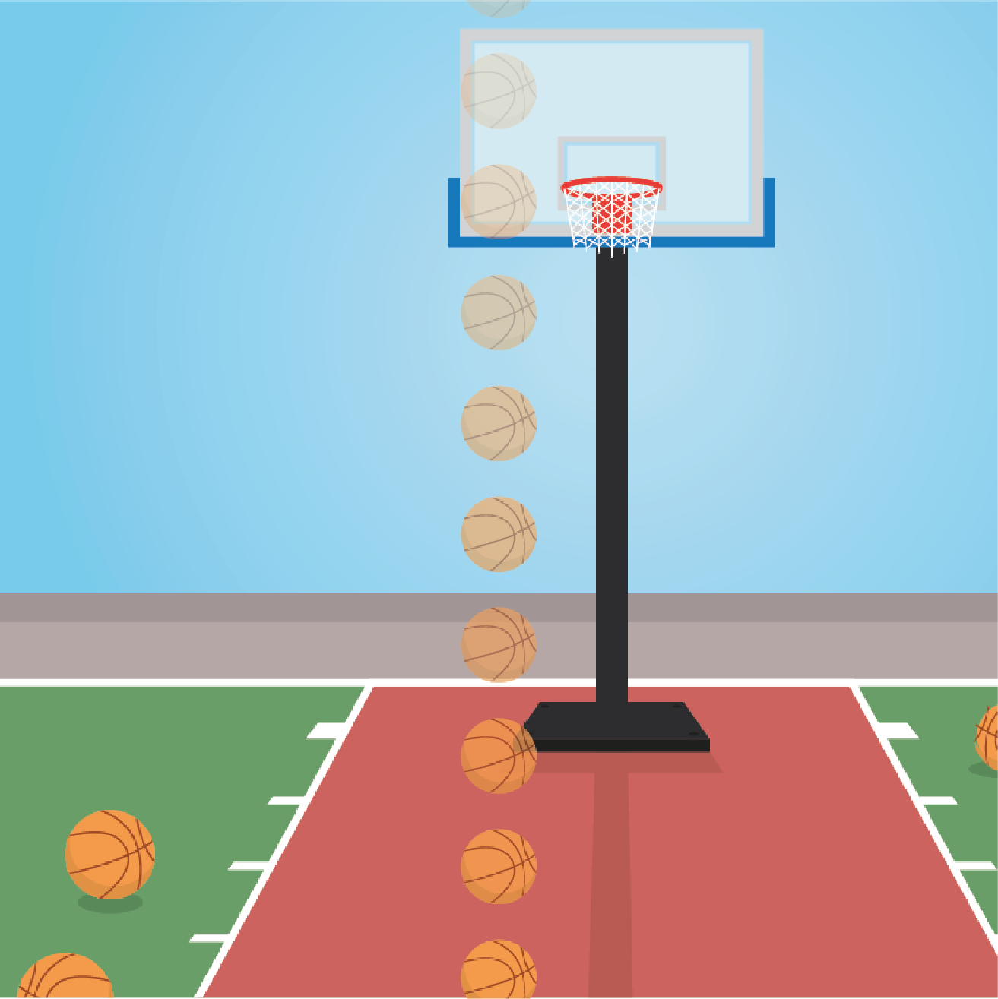

```{r setup, include = FALSE}
library('groundhog')
packages = c(
    'papaja',
    'tidyverse',
    'lsr', 
    'pwr', 
    'dplyr',
    'ggplot2',
    'ggimage',
    'lattice',
    'gridExtra',
    'quickpsy',
    'Bolstad'
  )
groundhog.library(packages, "2023-10-16")
r_refs("r-references.bib")


r_refs("references.bib")
knitr::opts_chunk$set(fig.pos = "!H", out.extra = "", warning = FALSE)
```
```{r analysis-preferences}
# Seed for random number generation
set.seed(42)
knitr::opts_chunk$set(cache.extra = knitr::rand_seed)
```

# Motivation

A study by @phan2022downwards found that our perception of acceleration/deceleration is biased depending on the motion direction: Objects moving downwards were perceived as accelerating less and/or decelerating more compared to objects moving upwards with the same acceleration/deceleration. This was not the case for objects moving to the left or right. @phan2022downwards explain these findings by people having adapted to the more commonly experienced downward acceleration. In the current study, we aim to replicate the bias for the vertical motion directions. Additionally, we want to test whether acceleration/deceleration perception for horizontally moving objects can also be biased when throughout the course of the experiment, one of these directions is mostly associated with acceleration and the other one with deceleration. <!-- We wish to investigate whether the taught bias elicits the same or different perceptual effect as the lifelong bias. -->

# Methods

We report how we determined our sample size, all data exclusions (if any), all manipulations, and all measures in the study. <!-- 21-word solution (Simmons, Nelson & Simonsohn, 2012; retrieved from http://ssrn.com/abstract=2160588) -->

## Participants

The research complies with all relevant ethical regulations, and was approved by the Research Ethics Committee of Birkbeck, University of London (study ID number 1812000). Participants will be recruited via Prolific, and will give informed consent prior to their participation. To be eligible to take part in this study, their Prolific approval rate will need to be 95% or higher, their reported first language English, and their age between 18 and 60. We will collect data until we reach 100 included participants (after applying our pre-registered exclusion criteria). The entire experiment will take 15 minutes to complete. Participants will be paid £2 for their participation, equivalent to an hourly wage of £8.

## Study Design

Participants will see a basketball court displayed over 80% of the screen height with a virtual height and width of 4 m (Fig. \@ref(fig:design1)). On each trial, a basketball appears on the court and either travels up, down, left, or right. The ball can be accelerating, decelerating, or travelling at a constant velocity and participants have to press the 'A' key if they think the ball is accelerating and the 'D' key if they think it is decelerating. They can respond as soon as the ball disappeared from the court and there is no time limit for their response. Participants are given written instructions prior to the task and at all times are shown the instructions "accelerating: a", "decelerating: d", and the number of trials completed in the current block. The next trial starts 1500 ms after a response has been made.

```{r design1, echo=FALSE, fig.cap="**Layout.** A basketball court is constantly shown on the screen and a basketball travels across the court in the horizontal or vertical directions, shown here going down (opacity of the ball illustrates time). Participants must decide if the ball is accelerating or decelerating and can respond once the ball has left the court.", out.width = '50%'}

```

To avoid participants using the amount of time the ball is on the screen as an indication of acceleration or deceleration, the ball remains on the screen for one of two screen durations, 1000 or 1500 ms. For each of the two screen durations, 11 equally spaced acceleration values are chosen from the range of ± $\frac{2 \cdot court \: size}{screen \: duration ^ 2}$. For the vertical trials, an approximately Gaussian distribution of values is chosen with a mean of 0 m/s^2^ (Fig. \@ref(fig:design2), bottom row). For the horizontal trials, a positive skew is given to one direction (Fig. \@ref(fig:design2), middle row, hereafter acc direction) and a negative skew to the other (Fig. \@ref(fig:design2), top row, hereafter dec direction), randomly assigned per participant. The skewed distributions have a mean acceleration of ± 1.74 m/s^2^. The distributions for the horizontal directions also include three extreme trials with maximal acceleration/deceleration. These extreme values are presented in the first block on the 1st, 3rd, and 5th trial of the respective direction to induce a strong expectation early in the experiment. 

```{r design2, echo=FALSE, fig.cap="**Acceleration distributions.** The distributions for the horizontal directions are skewed in order to induce an expectation of acceleration in one direction (middle) and of deceleration in the other (top). The skewed distributions have a mean acceleration of ± 1.74 m/s^2^. The vertical directions have an approximately Gaussian distribution (bottom) centred around a mean of 0 m/s^2^ (constant velocity). Long trials (green) remain on the screen for 1500 ms and short trials (blue) for 1000 ms. Extreme trials (red) have maximal acceleration/deceleration and are used to induce a strong expectation within the first five trials in that direction. All extreme trials have a screen duration of 1000 ms.", out.width = '110%'}

acc_values = c(-8, -6.4, -4.8, -3.54, -3.2, -2.8, -2.1, -1.6, -1.4, -1.1, -0.7, 0, 0.7, 1.1, 1.4, 1.6, 2.1, 2.8, 3.2, 3.54, 4.8, 6.4, 8);
acc_types = c("Extreme","Short","Short","Long","Short","Long","Long","Short","Long", "Short", "Long","Short","Long", "Short", "Long","Short","Long","Long","Short","Long","Short","Short","Extreme");
vert = data.frame(
  acc = c(-6.4, -4.8, -3.54, -3.54, -3.2, -2.8, -2.1, -2.1, -2.1, -1.6, -1.6, -1.6, -1.4, -1.4, -1.4, -1.4, -1.1,-1.1, -0.7, -0.7, -0.7, -0.7, -0.7, 0, 0, 0, 0, 0, 0, 0, 0, 0.7, 0.7, 0.7, 0.7, 0.7, 1.1, 1.1, 1.4, 1.4, 1.4, 1.4, 1.6, 1.6, 1.6, 2.1, 2.1, 2.1, 2.8, 3.2, 3.54, 3.54, 4.8, 6.4)
)

pos = data.frame(
  acc = c(-3.54, -3.2, -2.8, -2.1, -1.6, -1.4, -1.1, -1.1, -0.7, -0.7, -0.7, 0, 0, 0, 0, 0.7, 0.7, 0.7, 0.7, 1.1, 1.1, 1.4, 1.4, 1.4, 1.6, 1.6, 1.6, 1.6, 2.1, 2.1, 2.1, 2.1, 2.1, 2.8, 2.8, 2.8, 2.8, 2.8, 2.8, 3.2, 3.2, 3.2, 3.2, 3.2, 3.2, 3.54, 3.54, 3.54, 4.8, 4.8, 6.4, 8, 8, 8)
)

neg = data.frame(
  acc = c(3.54, 3.2, 2.8, 2.1, 1.6, 1.4, 1.1, 1.1, 0.7, 0.7, 0.7, 0, 0, 0, 0, -0.7, -0.7, -0.7, -0.7, -1.1, -1.1, -1.4, -1.4, -1.4, -1.6, -1.6, -1.6, -1.6, -2.1, -2.1, -2.1, -2.1, -2.1, -2.8, -2.8, -2.8, -2.8, -2.8, -2.8, -3.2, -3.2, -3.2, -3.2, -3.2, -3.2, -3.54, -3.54, -3.54, -4.8, -4.8, -6.4, -8, -8, -8)
)

color_table <- tibble(
  Trial = c("Extreme", "Long", "Short"),
  Color = c("red", "darkgreen", "blue4")
)

mvert <- ggplot(vert, aes(x=acc)) + geom_density(aes(y =after_stat(density)*(30))) + xlim(-8, 8)
mneg <- ggplot(neg, aes(x=acc)) + geom_density(aes(y = after_stat(density)*(30))) + xlim(-8, 8)
mpos <- ggplot(pos, aes(x=acc)) + geom_density(aes(y = after_stat(density)*(30))) + xlim(-8, 8)
pvert <- ggplot_build(mvert)
pneg <- ggplot_build(mneg)
ppos <- ggplot_build(mpos)
densevert = 0;
denseneg = 0;
densepos = 0;
for(value in acc_values){
  densevert = c(densevert, pvert$data[[1]]$y[which.min(abs(pvert$data[[1]]$x - value))]);
  denseneg = c(denseneg, pneg$data[[1]]$y[which.min(abs(pneg$data[[1]]$x - value))]);
  densepos = c(densepos, ppos$data[[1]]$y[which.min(abs(ppos$data[[1]]$x - value))]);
}

df <- data.frame(
  plot = c(rep("Vertical",23), rep("Negative Skew",23), rep("Positive Skew",23)),
  Acceleration = rep(acc_values, 3),
  Trial = rep(acc_types, 3),
  Frequency = c(0,1,1,2,1,1,3,3,4,2,5,8,5,2,4,3,3,1,1,2,1,1,0,3,1,2,3,6,6,5,4,3,2,4,4,3,2,1,1,1,1,1,1 ,0,0,0,0,0,0,1,1,1,1,1,1,2,3,4,4,2,3,4,5,6,6,3,2,1,3),
  Density = c(densevert[-1], denseneg[-1], densepos[-1])
)

a <- ggplot(df, aes(x = Acceleration, y = Frequency)) +
  geom_bar(stat="identity", aes(fill = Trial)) +
  geom_line(aes(y = Density)) +
  geom_area(aes(y = Density), alpha = 0.2, fill = "#56B4E9") +
  scale_fill_manual(values = color_table$Color) +
  #ggtitle("Acceleration Distributions") +
  theme(plot.title = element_text(hjust = 0.5)) +
  theme(axis.text.x=element_text(size=4, angle=90),
        axis.text.y=element_text(size=5),
        axis.title=element_text(size=10),
        plot.title=element_text(size=10),
        legend.title=element_text(size=6),
        legend.text=element_text(size=6),
        strip.text.y = element_text(size = 10),
        legend.key.size = unit(0.2, 'cm')) + 
  scale_x_continuous(breaks = acc_values) +
  facet_grid(rows = vars(plot)) 
a
```

The experiment starts with 16 practice trials - one accelerating and one decelerating trial for each of the two screen durations and four motion directions. For the vertical trials, acceleration values of -3.2, -2.8, 2.8, and 3.2 m/s^2^ are presented. For the acc direction, values of -1.6, -1.4, 3.6, and 8 m/s^2^ are presented and for the dec direction, -8, -3.6, 1.4, and 1.6 m/s^2^ are presented. Participants only receive feedback on their performance during practice. Afterwards, they complete eight blocks of 25 trials with the acceleration values shown in Fig. \@ref(fig:design2) and between each block they can take a short break. Trials alternate between vertical and horizontal, but the direction within the plane, the acceleration value and screen duration are pseudo-randomised.


### Randomization

The acc and dec directions for each participant, the motion direction within the plane, the acceleration value and screen duration for each trial will be determined pseudo-randomly by the Mersenne Twister pseudorandom number generator, initialized in a way that ensures registration time-locking [@mazor2019novel].


## Data analysis

### Rejection criteria

<!-- any RT exclusions? -->
Participants will be excluded if their overall accuracy falls below 75%.

### Hypotheses and analysis plan

This study is designed to test the perception of acceleration comparing motion directions associated with acceleration to ones associated with deceleration, either throughout life (up/down) or within this experiment (left/right).

The practice and extreme trials will be removed from the analysis, along with acceleration values exceeding ±3.6m/s^2^, such that all motion conditions include the same acceleration values. Psychometric curves will be fitted to the data from each participant using the quickpsy package in R [@linares2016quickpsy] separately for the four motion directions and two screen durations. The point of subjective constant velocity (PSCV) will be extracted from the fitted curves.
All statistical tests will be two-tailed and the significance level set to 0.05.

*Hypothesis 1 (ACCELERATION/DECELERATION DISCRIMINATION WITHOUT INITIAL SPEED)*: We will test the null hypothesis that accuracy is at chance (50%) for trials where the initial speed of accelerating balls is on average higher than the initial speed of decelerating balls. Accuracy will be calculated for decelerating trials with an initial speed of less than 3.7 m/s and accelerating trials with an initial speed of more than 3.7 m/s and a one-sample t-test will be performed.

*Hypothesis 2 (ACCELERATION/DECELERATION DISCRIMINATION WITHOUT FINAL SPEED)*: We will test the null hypothesis that accuracy is at chance (50%) for trials where the final speed of accelerating balls is on average lower than the final speed of decelerating balls. Accuracy will be calculated for decelerating trials with a final speed of more than 3.7 m/s and accelerating trials with a final speed of less than 3.7 m/s and a one-sample t-test will be performed.

*Hypothesis 3 (ACCELERATION PERCEPTION FOR UPWARD VS. DOWNWARD MOTION)*: We will test the null hypothesis that vertical acceleration perception is similar for upward and downward motion. For each participant, the proportion of 'accelerating' responses will be calculated for each acceleration value within the range ± 3.6 m/s^2^ and then averaged, separately for upward and downward motion. A paired-samples t-test will be performed comparing the proportion of 'accelerating' responses for upward vs. downward motion.

*Hypothesis 4 (ACCELERATION PERCEPTION FOR ACC VS. DEC DIRECTIONS)*: We will test the null hypothesis that horizontal acceleration perception is similar for acc and dec directions. For each participant, the proportion of 'accelerating' responses will be calculated for each acceleration value within the range ± 3.6 m/s^2^ and then averaged, separately for the acc and dec direction. A paired-samples t-test will be performed comparing the proportion of 'accelerating' responses for acc vs. dec directions.

*Hypothesis 5 (PSCV FOR UPWARD VS. DOWNWARD)*: We will test the null hypothesis that the PSCV is similar for upward and downward motion. This will be tested with a paired-samples t-test on the PSCV for upward and downward motion, averaged across the two screen durations.

*Hypothesis 6 (PSCV FOR ACC VS. DEC)*: We will test the null hypothesis that the PSCV is similar for acc and dec directions. This will be tested with a paired-samples t-test on the PSCV for the acc and dec direction, averaged across the two screen durations.

Exploratory analyses will compare slope and accuracy measures for upward vs. downward motion and acc vs. dec motion.

## Sample size justification

The study by Phan, Harris, and Kingdom (2023, in preparation) found an effect size of 0.4 for the difference in the PSCV for upward compared to downward motion. With 100 participants, we will have a statistical power of 98% to detect an effect of this size. By overpowering for the vertical effect, we hope to ensure any horizontal effects are also well powered enough with this sample size. It also allows us to get a good estimate of effect sizes for future studies.

# Analysis

```{r load_data, echo=FALSE}

data_frame <- read.csv("../Results/expOneResults.txt");
number_of_original_data_sets = length(unique(data_frame$subject_id))
# Clean the data by numericalising
# Exclude participants who fail to get 75% total accuracy
# Remove practice trials and acceleration values outside the +/-3.6 range
df = data_frame %>% 
  filter(trial_type == "moving-image") %>% #Select rows that are trials and not setup etc
  mutate(acceleration = as.numeric(acceleration)) %>%
  mutate(numerical_correct = if_else(correct=='true', 1, if_else(acceleration == 0, NaN, 0))) %>%
  mutate(recodeKey = if_else(key_response == 'a', 1, if_else(key_response == 'd', 0, NaN))) %>%
  mutate(recodeDir = if_else((direction == 'RIGHT' & right_bias == 'Positive') | (direction == 'LEFT' & left_bias == 'Positive'), 'ACCELERATING', if_else((direction == 'RIGHT' | direction == 'LEFT'), 'DECELERATING', direction))) %>%
  group_by(subject_id) %>%
  mutate(average_accuracy = mean(numerical_correct, na.rm = TRUE)) %>%
  ungroup() %>%
  filter(average_accuracy >= 0.75) %>%
  filter(practice == "false") %>%
  filter(abs(as.numeric(acceleration))<=3.6)

number_of_final_data_sets = length(unique(df$subject_id))

```


## Hypothesis 1 (ACCELERATION/DECELERATION DISCRIMINATION WITHOUT INITIAL SPEED)
```{r check_sensitivity_init, echo=FALSE, cache=TRUE}

acc_controlling_for_init_speed = df %>% 
  filter((acceleration<0 & initial_speed<3.7) | (acceleration>0 & initial_speed>3.7)) %>%
  group_by(subject_id) %>%
  summarize(acc=mean(numerical_correct))

```

People are able to discriminate acceleration without relying on the initial speed. Mean accuracy is `r acc_controlling_for_init_speed$acc%>%mean()` even in trials where the initial_speed of accelerating balls is on average higher than the initial speed of decelerating balls (`r apa_print(acc_controlling_for_init_speed$acc%>%t.test(mu=0.5))$statistic`).

## Hypothesis 2 (ACCELERATION/DECELERATION DISCRIMINATION WITHOUT FINAL SPEED)
```{r check_sensitivity_final, echo=FALSE, cache=TRUE}

acc_controlling_for_final_speed = df %>% 
  filter((acceleration<0 & final_speed>3.7) |(acceleration>0 & final_speed<3.8)) %>%
  group_by(subject_id) %>%
  summarize(acc=mean(numerical_correct))

```

People are not able to discriminate acceleration without relying on the final speed. Mean accuracy is `r acc_controlling_for_final_speed$acc%>%mean()` in trials where the final speed of accelerating balls is on average lower than the final speed of decelerating balls (`r apa_print(acc_controlling_for_final_speed$acc%>%t.test(mu=0.5))$statistic`).


## Hypothesis 3 (ACCELERATION PERCEPTION FOR UPWARD VS. DOWNWARD MOTION)
```{r check_bias_vertical, echo=FALSE, cache=TRUE}

bias = df %>% 
  group_by(subject_id, recodeDir, acceleration, screen_duration) %>% 
  summarise(prop_acc=mean(recodeKey)) %>%
  group_by(subject_id, recodeDir, screen_duration) %>% 
  summarise(screen_bias=mean(prop_acc)) %>% 
  group_by(subject_id, recodeDir) %>% 
  summarise(bias=mean(screen_bias)) %>% 
  spread(recodeDir, bias)

vertical_bias = t.test(bias$UP, bias$DOWN, paired=TRUE)

vertical_bias_bayes = ttestBF(bias$UP, bias$DOWN, paired=TRUE, alternative = 'two.sided')
```

People have a bias to report downward moving objects as having a less positive acceleration than upward moving objects (`r apa_print(vertical_bias)$statistic`).

```{r plot_vertical_biases, echo=FALSE, fig.cap="Plotting the bias to report accelerating for the vertical conditions."}

plot_vertical_bias = bias %>%
  mutate(gradient = if_else(DOWN-UP==0, 'neutral',if_else(DOWN-UP>0, 'negative', 'positive'))) %>%
  pivot_longer(cols = c('DOWN', 'UP'), names_to = 'recodeDir', values_to = 'bias') %>%
  mutate(x = if_else(recodeDir == 'DOWN', 0, 1))

if(vertical_bias$p.value<0.001){
  annotation = '***';
} else if(vertical_bias$p.value<0.01){
  annotation = '**';
} else if(vertical_bias$p.value<0.05){
  annotation = '*';
} else {
  annotation = 'NS';
}

ggplot(d = plot_vertical_bias, aes(x=x, y=bias, colour=gradient)) +
  geom_line(aes(group=subject_id), alpha = 0.4) +
  geom_point(aes(group=subject_id), alpha = 0.4) +
  stat_summary(
    geom = "linerange",
    fun.data = mean_sdl, 
    fun.args = list(mult = 1),
    colour = "black", size = 1
   ) +
   stat_summary(
    geom = "line",
    fun = mean,
    colour = "black", size = 1
   ) +
  stat_summary(
    geom = "point",
    fun = mean,
    colour = "black", size = 2
   ) +
  geom_line(d = data.frame(xline=c(0,1), yline=c(0.75,0.75)), aes(x=xline, y=yline), colour = "black") +
  annotate("text", x=0.5, y=0.76, label = annotation) +
  xlab('Condition') +
  ylab('Bias') +
  ggtitle('Bias to report accelerating.') +
  scale_x_continuous(breaks=c(0, 1), labels=c("DOWN","UP"))
```

## Hypothesis 4 (ACCELERATION PERCEPTION FOR ACC VS. DEC DIRECTIONS)
```{r check_bias_horizontal, echo=FALSE, cache=TRUE}
horizontal_bias = t.test(bias$ACCELERATING, bias$DECELERATING, paired='TRUE')
horizontal_bias_bayes = ttestBF(bias$ACCELERATING, bias$DECELERATING, paired=TRUE, alternative = 'two.sided')
```
People have a bias to report the 'accelerating' objects as having a less positive acceleration than the 'decelerating' objects (`r apa_print(horizontal_bias)$statistic`).
```{r plot_horizontal_biases, echo=FALSE, fig.cap="Plotting the bias to report accelerating for the horizontal conditions."}}
plot_horizontal_bias = bias %>%
  mutate(gradient = if_else(ACCELERATING-DECELERATING==0, 'neutral',if_else(ACCELERATING-DECELERATING>0, 'negative', 'positive'))) %>%
  pivot_longer(cols = c('ACCELERATING', 'DECELERATING'), names_to = 'recodeDir', values_to = 'bias') %>%
  mutate(x = if_else(recodeDir == 'ACCELERATING', 0, 1))

if(horizontal_bias$p.value<0.001){
  annotation = '***';
} else if(horizontal_bias$p.value<0.01){
  annotation = '**';
} else if(horizontal_bias$p.value<0.05){
  annotation = '*';
} else {
  annotation = 'NS';
}

ggplot(d = plot_bias, aes(x=x, y=bias, colour=gradient)) +
  geom_line(aes(group=subject_id), alpha = 0.4) +
  geom_point(aes(group=subject_id), alpha = 0.4) +
  stat_summary(
    geom = "linerange",
    fun.data = mean_sdl, 
    fun.args = list(mult = 1),
    colour = "black", size = 1
   ) +
   stat_summary(
    geom = "line",
    fun = mean,
    colour = "black", size = 1
   ) +
  stat_summary(
    geom = "point",
    fun = mean,
    colour = "black", size = 2
   ) +
  geom_line(d = data.frame(xline=c(0,1), yline=c(0.75,0.75)), aes(x=xline, y=yline), colour = "black") +
  annotate("text", x=0.5, y=0.76, label = annotation) +
  xlab('Condition') +
  ylab('Bias') +
  ggtitle('Bias to report accelerating.') +
  scale_x_continuous(breaks=c(0, 1), labels=c("Accelerating","Decelerating"))
```

## Hypothesis 5 (PSCV FOR UPWARD VS. DOWNWARD)
```{r check_pscv_vertical, echo=FALSE, cache=TRUE}
fullFit <- quickpsy(d = df, x=acceleration, k=recodeKey, grouping = .(subject_id, recodeDir,screen_duration), bootstrap = "none");
#plotcurves(fullFit) + xlim(-4,4) + theme(legend.position="none")

pscvs = fullFit$thresholds %>%
  pivot_wider(names_from = screen_duration, values_from = thre, names_prefix = 'sd_') %>%
  mutate(mean_pscv = mean(c(sd_1000, sd_1500))) %>%
  select(subject_id, recodeDir, mean_pscv) %>%
  pivot_wider(names_from = recodeDir, values_from = mean_pscv)

vertical_pscvs = pscvs %>% 
  filter(abs(UP)<=8 & abs(DOWN)<=8)

vertical_pscv = t.test(vertical_pscvs$UP, vertical_pscvs$DOWN, paired='TRUE')
vertical_pscv_bayes = ttestBF(vertical_pscvs$UP, vertical_pscvs$DOWN, paired=TRUE, alternative='two.sided')
```
The PSCV for downward moving objects is more positive than the PSCV for upward moving objects (`r apa_print(vertical_pscv)$statistic`).
```{r plot_mean_pscv, echo=FALSE, fig.cap="Psychometric curves showing the horizontal and vertical biases."}
fullAverageFit <- quickpsy(d = df, x=acceleration, k=recodeKey, grouping = .(recodeDir,screen_duration), bootstrap = "none");
plotcurves(fullAverageFit) + xlim(-4,4)
```

## Hypothesis 6 (PSCV FOR ACC VS. DEC)
```{r check_pscv_horizontal, echo=FALSE, cache=TRUE}
horizontal_pscvs = pscvs %>% 
  filter(abs(ACCELERATING)<=8 & abs(DECELERATING)<=8)

horizontal_pscv = t.test(horizontal_pscvs$ACCELERATING, horizontal_pscvs$DECELERATING, paired='TRUE')
horizontal_pscv_bayes = ttestBF(horizontal_pscvs$ACCELERATING, horizontal_pscvs$DECELERATING, paired=TRUE, alternative='two.sided')
```
The PSCV for 'accelerating' objects is more positive than the PSCV for 'decelerating' objects (`r apa_print(horizontal_pscv)$statistic`).


# Next Steps

We have both a lifelong and recently learned effect of suppressed perception of expected accelerating motion. This leaves us in a situation where our hypothesis about the length of time that an expectation has been developed affects the direction of suppression and enhancement. What other causes could there be? 

## Eye Motion
People could be making these judgements based upon estimating a position to which they saccade. Where decelerating objects will remain behind the post-saccade eye position and accelerating objects will surpass the post-saccade eye position. To test this hypothesis, eye tracking could be utilised. Can the average difference between eye position and ball position estimate the participant response?

## Adaptation
Potentially the repetitive acceleration in one direction is causing an adaptation-like effect where cells/neurons/brain regions are responding less to the repeated stimulus and thus mistake deviations from the norm as repulsion from the true value. This can be tested by altering the cue for the accelerating and decelerating directions. Rather than direction being the cue for the bias, two differently coloured balls could be the cues for bias and the directions randomised on the horizontal plane to avoid adaptation effects.

## Cue Timing
The cue for expected behaviour is currently shown at the same time as the target because once the ball arrives on the screen the participant will begin judging acceleration and also be made aware of the direction and thus the bias. Perhaps the cue is required to be processed and passed down the perceptual hierarchy before it can cause an enhancement - in faster situations the supression is favoured. The mechanism for this theory is not yet fully realised. This can be tested by showing a cue before the ball arrives on the screen - such as an audio cue or change in background colour.

## Stimulus Integration Across Time
To judge acceleration, multiple time-points are required to be processed. This slow integration could give time for later processes to up weight any surprising information in the signal. This hypothesis could be tested by repeating the essence of the paradigm with static or briefly presented stimuli.

## Continous Vs Discrete Judgements
Acceleration values are inherently on a continuous scale which allows us to give responses that align mostly with the truth but may deviate by tiny amounts. Conversely, discrete judgements with large gaps between bins only allow for one thing to be true at a time. So even if the percept is not exactly in that bin, it is still the closest option and creates an enhancement of the expectation rather than a suppression. 

# Supplementary Material

## Constant Velocity Trials

```{r constant_velocity_trials, echo=FALSE, fig.cap="The bias to report accelerating on constant velocity trials."}
jitter = function(subject_id){
  set.seed(strtoi(substr(subject_id, 1, 4), 16L))
  return(rnorm(1, 0, 0.1))
}

df_const = df %>%
  filter(as.numeric(acceleration)==0) %>%
  filter(recodeDir == 'ACCELERATING' | recodeDir == 'DECELERATING') %>%
  group_by(subject_id, recodeDir) %>%
  reframe(prop_acc_resp = mean(recodeKey)) %>%
  pivot_wider(names_from = 'recodeDir', values_from = 'prop_acc_resp') %>%
  mutate(gradient = if_else(ACCELERATING-DECELERATING==0, 'neutral', if_else(ACCELERATING-DECELERATING>0, 'negative', 'positive'))) %>%
  pivot_longer(cols = c('ACCELERATING', 'DECELERATING'), names_to = 'recodeDir', values_to = 'prop_acc_resp') %>%
  mutate(pos = if_else(recodeDir == 'ACCELERATING', 0, 1)) %>%
  mutate(jitter = sapply(subject_id, jitter)) %>%
  mutate(x = pos+jitter)

df_const_stats = df_const %>%
  select(subject_id, recodeDir, prop_acc_resp) %>%
  pivot_wider(names_from = 'recodeDir', values_from = 'prop_acc_resp')
const_stat = t.test(df_const_stats$ACCELERATING, df_const_stats$DECELERATING, paired = 'TRUE')

if(const_stat$p.value<0.001){
  annotation = '***';
} else if(const_stat$p.value<0.01){
  annotation = '**';
} else if(const_stat$p.value<0.05){
  annotation = '*';
} else {
  annotation = 'NS';
}

ggplot(d = df_const, aes(x=pos, y=prop_acc_resp, colour=gradient)) +
  geom_line(aes(x=x, group = subject_id), alpha = 0.4) +
  geom_point(aes(x=x, group = subject_id), alpha = 0.4) +
  stat_summary(
    geom = "linerange",
    fun.data = mean_sdl, 
    fun.args = list(mult = 1),
    colour = "black", size = 1
  ) +
  stat_summary(
    geom = "line",
    fun = mean,
    colour = "black", size = 1
   ) +
  stat_summary(
    geom = "point",
    fun = mean,
    colour = "black", size = 2
   ) +
  geom_line(d = data.frame(xline=c(0,1), yline=c(1,1)), aes(x=xline, y=yline), colour = "black") +
  annotate("text", x=0.5, y=1, label = annotation) +
  xlab('Condition') +
  ylab('Proportion of accelerating responses') +
  ggtitle('Proportion of accelerating responses to constant velocity objects.') +
  scale_x_continuous(breaks=c(0, 1), labels=c("Accelerating","Decelerating"))
```

```{r plot_vert_const_vel, echo=FALSE, fig.cap="The bias to report accelerating on constant velocity trials."}
df_const = df %>%
  filter(as.numeric(acceleration)==0) %>%
  filter(recodeDir == 'DOWN' | recodeDir == 'UP') %>%
  group_by(subject_id, recodeDir) %>%
  reframe(prop_acc_resp = mean(recodeKey)) %>%
  pivot_wider(names_from = 'recodeDir', values_from = 'prop_acc_resp') %>%
  mutate(gradient = if_else(DOWN-UP==0, 'neutral', if_else(DOWN-UP>0, 'negative', 'positive'))) %>%
  pivot_longer(cols = c('DOWN', 'UP'), names_to = 'recodeDir', values_to = 'prop_acc_resp') %>%
  mutate(pos = if_else(recodeDir == 'DOWN', 0, 1)) %>%
  mutate(jitter = sapply(subject_id, jitter)) %>%
  mutate(x = pos+jitter)

df_const_stats = df_const %>%
  select(subject_id, recodeDir, prop_acc_resp) %>%
  pivot_wider(names_from = 'recodeDir', values_from = 'prop_acc_resp')
const_stat = t.test(df_const_stats$DOWN, df_const_stats$UP, paired = 'TRUE')

if(const_stat$p.value<0.001){
  annotation = '***';
} else if(const_stat$p.value<0.01){
  annotation = '**';
} else if(const_stat$p.value<0.05){
  annotation = '*';
} else {
  annotation = 'NS';
}

ggplot(d = df_const, aes(x=pos, y=prop_acc_resp, colour=gradient)) +
  geom_line(aes(x=x, group = subject_id), alpha = 0.4) +
  geom_point(aes(x=x, group = subject_id), alpha = 0.4) +
  stat_summary(
    geom = "linerange",
    fun.data = mean_sdl, 
    fun.args = list(mult = 1),
    colour = "black", size = 1
  ) +
  stat_summary(
    geom = "line",
    fun = mean,
    colour = "black", size = 1
   ) +
  stat_summary(
    geom = "point",
    fun = mean,
    colour = "black", size = 2
   ) +
  geom_line(d = data.frame(xline=c(0,1), yline=c(1,1)), aes(x=xline, y=yline), colour = "black") +
  annotate("text", x=0.5, y=1, label = annotation) +
  xlab('Condition') +
  ylab('Proportion of accelerating responses') +
  ggtitle('Proportion of accelerating responses to constant velocity objects.') +
  scale_x_continuous(breaks=c(0, 1), labels=c("Down","Up"))
```


## Bayes Factor across time

```{r bayes_across_time, echo=FALSE, fig.cap="Bayes factor calculated for each participant in order of data collection for horizontal data."}
this_bias = cbind(bias, data.frame(SID = 1:nrow(bias)));
bayes_factors = list();
for(i in 2:nrow(this_bias)){
  this_set = this_bias %>% filter(SID<=i);
  bayes_factors = c(bayes_factors, as.numeric(as.vector(ttestBF(this_set$ACCELERATING, this_set$DECELERATING, paired=TRUE, alternative='two.sided'))));
}

pscvs_minus_hor_outliners = pscvs %>% filter(abs(ACCELERATING)<=8 & abs(DECELERATING)<=8)
this_pscv = cbind(pscvs_minus_hor_outliners, data.frame(SID = 1:nrow(pscvs_minus_hor_outliners)));
bayes_factors_pscv = list();
for(i in 2:nrow(this_pscv)){
  this_set = this_pscv %>% filter(SID<=i);
  bayes_factors_pscv = c(bayes_factors_pscv, as.numeric(as.vector(ttestBF(this_set$ACCELERATING, this_set$DECELERATING, paired=TRUE, alternative='two.sided'))));
}
if(length(bayes_factors)>length(bayes_factors_pscv)){
  bayes_factors_pscv = c(bayes_factors_pscv, rep(NA, length(bayes_factors)-length(bayes_factors_pscv)))
} else if(length(bayes_factors)<length(bayes_factors_pscv)){
  bayes_factor = c(bayes_factor, rep(NA, -length(bayes_factors)+length(bayes_factors_pscv)))
}

bayes_factor_df = data.frame(bayes_factors_bias = as.numeric(bayes_factors), bayes_factors_pscv = as.numeric(bayes_factors_pscv), participant_count = 1:length(bayes_factors)) %>%
  pivot_longer(cols = c('bayes_factors_pscv', 'bayes_factors_bias'), names_prefix = 'bayes_factors_', names_to = 'test_type', values_to = 'bias')

ggplot(bayes_factor_df, aes(x=participant_count, y=bias, colour = test_type)) +
  geom_point() +
  geom_segment(aes(x = 0, xend = nrow(bayes_factor_df), y = 3, yend = 3)) +
  geom_segment(aes(x = 0, xend = nrow(bayes_factor_df), y = 1/3, yend = 1/3)) +
  scale_y_continuous(trans='log10')
```

# References

```{=tex}
\begingroup
\setlength{\parindent}{-0.5in}
\setlength{\leftskip}{0.5in}
```
::: {#refs custom-style="Bibliography"}
:::

```{=tex}
\endgroup
```
