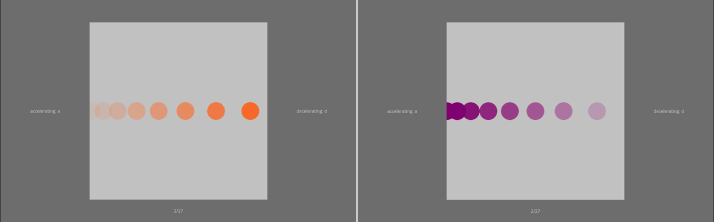

```{r setup, include = FALSE}
library('groundhog')
packages = c(
    'papaja',
    'tidyverse',
    'lsr', 
    'pwr', 
    'dplyr',
    'ggplot2',
    'ggimage',
    'lattice',
    'gridExtra',
    'quickpsy',
    'cowplot',
    'grid',
    'BayesFactor'
  )
groundhog.library(packages, "2023-10-16")
r_refs("references.bib")
knitr::opts_chunk$set(fig.pos = "!H", out.extra = "", warning = FALSE)
```

```{r analysis-preferences}
# Seed for random number generation
set.seed(42)
knitr::opts_chunk$set(cache.extra = knitr::rand_seed)
```

# Motivation

In a previous experiment, we found perceptual repulsion effects from expectations about the acceleration of objects on the horizontal axis. An expectation was induced such that objects would accelerate more often in one direction (accelerating direction) and decelerate more often in the other (decelerating direction). Objects in the accelerating direction were perceived as accelerating less than objects in the decelerating direction. The observed repulsion from expectation contrasts with attractive perceptual expectation effects that are more typically observed in vision. In the current study, we ask whether the repulsive effect in acceleration perception was caused by motion direction being the cue or whether the nature of the cue is irrelevant to the perceptual effect. Therefore, we will replicate the study with the colour of the ball, rather than the direction of motion, predicting the acceleration value and observe whether the repulsion effect persists.


# Methods

We report below how we determined our sample size, all exclusion criteria, all manipulations, and all measures in the study.

## Participants

The research complies with all relevant ethical regulations, and was approved by the Research Ethics Committee of Birkbeck, University of London (study ID number 1812000). Participants will be recruited via Prolific, and will give informed consent prior to their participation. To be eligible to take part in this study, their Prolific approval rate will need to be 95% or higher, their reported first language English, their age between 18 and 60, and they cannot have taken part in previous experiments. We will collect data until a Bayesian t-test offers sufficient evidence for (BF>3), or against (BF<1/3), the null hypothesis described below, or until we reach a pre-specified maximum number of 200 included participants. The entire experiment will take approximately 15 minutes to complete. Participants will be paid £2 for their participation, approximately equivalent to an hourly wage of £8.

## Study Design

Participants will see a light grey square displayed over 80% of the screen height with a virtual height and width of 4 m (Fig. \@ref(fig:design1)). On each trial, a circle, with virtual diameter of 40cm (10% of the square height) travels either left or right across the entire width of the grey square. It can be accelerating, decelerating, or travelling at a constant velocity. Participants are asked to press the 'A' key if they think the circle is accelerating and the 'D' key if they think it is decelerating. They can respond as soon as the circle disappears from the square and there is no time limit for their response. Participants are given written instructions prior to the task and at all times are shown the instructions "accelerating: a", "decelerating: d", and the number of trials completed in the current block. The next trial starts 1000 ms after a response has been made.

```{r design1, echo=FALSE, fig.cap="**Stimuli.** A light grey square is constantly shown on the screen. On each trial, a coloured circle travels across the square. Participants must decide if the circle is accelerating or decelerating (here orange is accelerating and purple is decelerating) and can respond once it has left the square.", out.width = '100%'}

```

To avoid participants using the amount of time the circle is on the screen as an indication of acceleration or deceleration, the circle remains on the screen for one of two screen durations, 1000 or 1500 ms. For each of the two screen durations, 11 equally spaced acceleration values are chosen from the range of ± $\frac{2 \cdot square \: length}{screen \: duration ^ 2}$. Balls are one of two colours, one colour is given a distribution of acceleration values with more positive than negative acceleration values and a positive mean (Fig. \@ref(fig:design2), bottom row, hereafter accelerating colour). The second colour is given a distribution of acceleration values with more negative than positive acceleration values and a negative mean (Fig. \@ref(fig:design2), top row, hereafter decelerating colour), the accelerating and decelerating colours are randomly assigned per participant. The distributions have a mean acceleration of ± 1.74 m/s^2^ and also include 6 extreme trials with maximal acceleration/deceleration.

```{r design2, echo=FALSE, fig.cap="**Acceleration distributions.** The distribution of acceleration and deceleration values presented for each coloured circle are shifted to induce an expectation of acceleration for one colour (bottom panel) and of deceleration for the other (top panel). These distributions have a mean acceleration of ± 1.74 m/s^2^. Long trials (green) remain on the screen for 1500 ms and short trials (blue) for 1000 ms. Extreme trials (red) have maximal acceleration/deceleration and are used to induce a strong expectation within the first twenty trials for that colour. All extreme trials have a screen duration of 1000 ms.", out.width = '110%'}

acc_values = c(-8, -6.4, -4.8, -3.54, -3.2, -2.8, -2.1, -1.6, -1.4, -1.1, -0.7, 0, 0, 0.7, 1.1, 1.4, 1.6, 2.1, 2.8, 3.2, 3.54, 4.8, 6.4, 8);
acc_types = c("Extreme","Short","Short","Long","Short","Long","Long","Short","Long", "Short", "Long", "Short", "Long", "Long", "Short", "Long","Short","Long","Long","Short","Long","Short","Short","Extreme");

pos = data.frame(
  acc = rep(c(-3.54, -3.2, -2.8, -2.1, -1.6, -1.4, -1.1, -1.1, -0.7, -0.7, -0.7, 0, 0, 0, 0, 0.7, 0.7, 0.7, 0.7, 1.1, 1.1, 1.4, 1.4, 1.4, 1.6, 1.6, 1.6, 1.6, 2.1, 2.1, 2.1, 2.1, 2.1, 2.8, 2.8, 2.8, 2.8, 2.8, 2.8, 3.2, 3.2, 3.2, 3.2, 3.2, 3.2, 3.54, 3.54, 3.54, 4.8, 4.8, 6.4, 8, 8, 8), 2)
)

neg = data.frame(
  acc = rep(c(3.54, 3.2, 2.8, 2.1, 1.6, 1.4, 1.1, 1.1, 0.7, 0.7, 0.7, 0, 0, 0, 0, -0.7, -0.7, -0.7, -0.7, -1.1, -1.1, -1.4, -1.4, -1.4, -1.6, -1.6, -1.6, -1.6, -2.1, -2.1, -2.1, -2.1, -2.1, -2.8, -2.8, -2.8, -2.8, -2.8, -2.8, -3.2, -3.2, -3.2, -3.2, -3.2, -3.2, -3.54, -3.54, -3.54, -4.8, -4.8, -6.4, -8, -8, -8), 2)
)

color_table <- tibble(
  Trial = c("Extreme", "Long", "Short"),
  Color = c("red", "darkgreen", "blue4")
)

mneg <- ggplot(neg, aes(x=acc)) + geom_density(aes(y = after_stat(density)*(60))) + xlim(-8, 8)
mpos <- ggplot(pos, aes(x=acc)) + geom_density(aes(y = after_stat(density)*(60))) + xlim(-8, 8)
pneg <- ggplot_build(mneg)
ppos <- ggplot_build(mpos)
denseneg = 0;
densepos = 0;
for(value in acc_values){
  denseneg = c(denseneg, pneg$data[[1]]$y[which.min(abs(pneg$data[[1]]$x - value))]);
  densepos = c(densepos, ppos$data[[1]]$y[which.min(abs(ppos$data[[1]]$x - value))]);
}

df <- data.frame(
  plot = c(rep("Negative Mean",24), rep("Positive Mean",24)),
  Acceleration = rep(acc_values, 2),
  Trial = rep(acc_types, 2),
  Frequency = 2*c(3,1,2,3,6,6,5,4,3,2,4,2,2,3,2,1,1,1,1,1,1,0,0,0,0,0,0,1,1,1,1,1,1,2,3,2,2,4,2,3,4,5,6,6,3,2,1,3),
  Density = c(denseneg[-1], densepos[-1])
)

a <- ggplot(df, aes(x = Acceleration, y = Frequency)) +
  geom_bar(stat="identity", aes(fill = Trial)) +
  geom_line(aes(y = Density)) +
  geom_area(aes(y = Density), alpha = 0.2, fill = "#56B4E9") +
  scale_fill_manual(values = color_table$Color) +
  theme(plot.title = element_text(hjust = 0.5)) +
  theme(axis.text.x=element_text(size=4, angle=90),
        axis.text.y=element_text(size=5),
        axis.title=element_text(size=10),
        plot.title=element_text(size=10),
        legend.title=element_text(size=6),
        legend.text=element_text(size=6),
        strip.text.y = element_text(size = 10),
        legend.key.size = unit(0.2, 'cm')) + 
  scale_x_continuous(breaks = acc_values) +
  ylim(0, 13) +
  facet_grid(rows = vars(plot)) 
a
```

The experiment starts with eight practice trials - one accelerating and one decelerating trial for each of the two screen durations and two colours. For the accelerating colour, values of -1.6, -1.4, 3.6, and 8 m/s^2^ are presented and for the decelerating colour, -8, -3.6, 1.4, and 1.6 m/s^2^ are presented. Participants only receive feedback on their performance during practice. Afterwards, they complete 8 blocks of 27 trials with the acceleration values shown in Fig. \@ref(fig:design2) and between each block they can take a short break.


The acceleration distributions for each colour contain 6 extreme trials, where the acceleration/deceleration is maximal for the respective colour. These extreme values are all presented, in a random order, in the first 20 trials of that colour to induce a strong expectation early in the experiment. The directions of all trials are pseudo-randomised such that for each acceleration value and colour, the ball travels left and right an equal number of times. The trial colour, direction, and acceleration is randomised across the experiment within the described restrictions.

### Randomization

For each participant, the accelerating and decelerating colours will be pseudorandomised. Moreover, for each trial, the motion direction, the acceleration value, the ball colour, and screen duration will also be pseudorandomised. Pseudorandomisation will be performed with the Mersenne Twister pseudorandom number generator, initialized in a way that ensures registration time-locking [@mazor2019novel].

## Data analysis

### Rejection criteria

Participants will be excluded if their overall accuracy falls below 75% for all trials, including practice and extreme trials.

### Hypotheses and analysis plan

The data will be analysed as explained below using the Bayesian framework, all tests will be two tailed and require a BF>3 to accept the alternate hypothesis and BF<1/3 to accept the null hypothesis. The Bayesian t-tests will be run using the ttestBF function of the r package BayesFactor [@R-BayesFactor]. A scale factor of 0.14, equal to half the previously observed effect size, will be input to control the scale of the prior distribution. All conclusions will be drawn from the Bayesian analysis, however, we will additionally report the relevant frequentist statistics for readers more accustomed to this statistical method.

*Hypothesis 1 (ACCELERATION PERCEPTION FOR ACCELERATING VS. DECELERATING COLOURS)*: We will test the null hypothesis that horizontal acceleration perception is similar for coloured objects when one colour is more often shown accelerating and the other is more often shown decelerating. For each participant, the proportion of 'accelerating' responses will be calculated for each acceleration/deceleration value within the range ± 3.6 m/s^2^ and then averaged, separately for the screen durations and the accelerating/decelerating colour. The bias for each screen duration will be averaged to give a single value for each colour and each participant. A Bayesian paired-samples t-test will be performed comparing the proportion of 'accelerating' responses for the accelerating colour compared to the decelerating colour.

*Hypothesis 2 (PSCV FOR ACCELERATING VS. DECELERATING)*: We will test the null hypothesis that the point of subjective constant velocity (PSCV) is similar for coloured objects when one colour is more often shown accelerating and the other is more often shown decelerating. The PSCV will be estimated using the quickpsy function of the quickpsy R package with acceleration/deceleration values in the range ± 3.6 m/s^2^ as the explanatory variable, and participant, screen duration and colour as grouping factors [@R-quickpsy]. Psychometric curves with a PSCV outside of the tested range (± 8 m/s^2^) will be excluded from analysis. A single PSCV will be calculated for each colour by taking the mean of the PSCVs for each screen duration. A Bayesian paired-samples t-test will be performed comparing the PSCV for the accelerating and decelerating colours.

Exploratory analyses will compare slope and accuracy measures for the accelerating vs. decelerating colours.

## Sample size justification

This study will use a Bayesian stopping rule based on hypothesis 2. We will collect participants until a Bayesian t-test gives a Bayes factor of more than 3, or less than 1/3. The Bayesian t-test will be run with a scale factor of 0.14 using the ttestBF function of the r package BayesFactor [@R-BayesFactor]. We will initially collect 50 participants and perform the Bayesian t-test on the data for hypothesis 2. Then, if the Bayes factor is not above 3 or below 1/3, we will collect an additional 25 participants and re-test the Bayes factor. We will continue this process until enough evidence for or against the null hypothesis is collected, or until the participant cap of 200 included participants is reached.

# References

```{=tex}
\begingroup
\setlength{\parindent}{-0.5in}
\setlength{\leftskip}{0.5in}
```
::: {#refs custom-style="Bibliography"}
:::

```{=tex}
\endgroup
```
