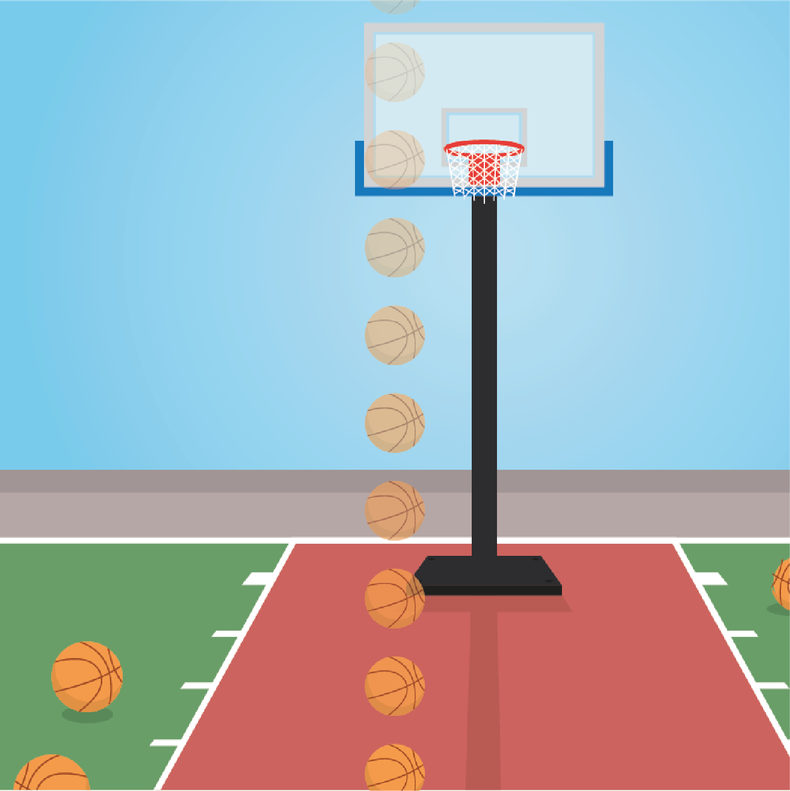
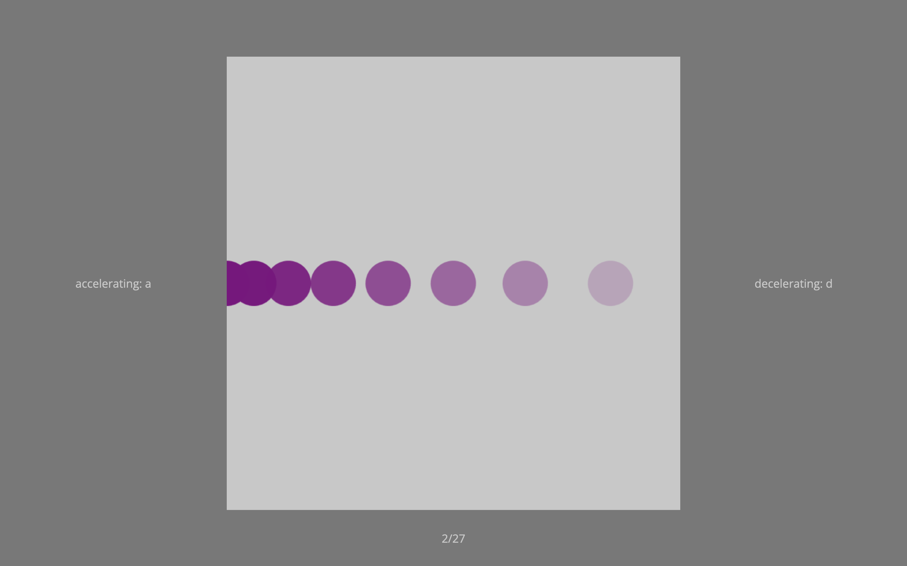

```{r setup, include = FALSE}
library('groundhog')
packages = c(
    'papaja',
    'tidyverse',
    'lsr', 
    'pwr', 
    'dplyr',
    'ggplot2',
    'ggimage',
    'lattice',
    'gridExtra',
    'quickpsy',
    'cowplot',
    'grid',
    'BayesFactor',
    'ggsignif',
    'ggpubr'
  )
groundhog.library(packages, "2023-10-16")
r_refs("references.bib")
knitr::opts_chunk$set(fig.pos = "!H", out.extra = "", warning = FALSE)
```

```{r analysis-preferences}
# Seed for random number generation
set.seed(42)
knitr::opts_chunk$set(cache.extra = knitr::rand_seed)
```

# Paradigms

## Experiment One - Bias Horizontal

### Motivation

@phan2022downwards found that objects travelling downwards are perceived to have a more negative acceleration than objects travelling upwards, with no difference in the perception of horizontally travelling objects. This difference shows a suppression effect of the expectation that objects accelerate downwards due to gravity. The current experiment induces an expectation in the horizontal plane whereby one direction more often accelerates and the other more often decelerates. A basketball scene is produced where participants are asked to respond a to accelerating objects and d to decelerating objects, the layout is shown in figure \@ref(fig:exp1layout). The balls travel up, down, left, or right. In the vertical plane the acceleration distributions are not biased and centered around constant velocity, following the distribution in the bottom row of figure \@ref(fig:exp1distributions). In the horizontal plane, one direction is assigned to have a decelerating mean (more decelerating than accelerating trials), following the distribution in the top row of figure \@ref(fig:exp1distributions), and the other direction is assigned an accelerating mean (more accelerating than decelerating trials), following the distribution in the middle row of figure \@ref(fig:exp1distributions). 100 included participants were tested.

### Results Summary

This experiment shows that balls travelling in the direction associated with a positive mean will be perceived to have a more negative acceleration than those travelling in the direction associated with a negative mean. This finding shows that the perceptual expectation suppression found in the vertical plane is replicated in the horizontal plane.

```{r exp1layout, echo=FALSE, fig.cap="**Layout.** A basketball court is constantly shown on the screen and a basketball travels across the court in the horizontal or vertical directions, shown here going down (opacity of the ball illustrates time). Participants must decide if the ball is accelerating or decelerating and can respond once the ball has left the court.", out.width = '50%'}

```

```{r exp1distributions, echo=FALSE, fig.cap="**Acceleration distributions.** The distributions for the horizontal directions are skewed in order to induce an expectation of acceleration in one direction (middle) and of deceleration in the other (top). The skewed distributions have a mean acceleration of ± 1.74 m/s^2^. The vertical directions have an approximately Gaussian distribution (bottom) centred around a mean of 0 m/s^2^ (constant velocity). Long trials (green) remain on the screen for 1500 ms and short trials (blue) for 1000 ms. Extreme trials (red) have maximal acceleration/deceleration and are used to induce a strong expectation within the first five trials in that direction. All extreme trials have a screen duration of 1000 ms.", out.width = '110%'}

acc_values = c(-8, -6.4, -4.8, -3.54, -3.2, -2.8, -2.1, -1.6, -1.4, -1.1, -0.7, 0, 0.7, 1.1, 1.4, 1.6, 2.1, 2.8, 3.2, 3.54, 4.8, 6.4, 8);
acc_types = c("Extreme","Short","Short","Long","Short","Long","Long","Short","Long", "Short", "Long","Short","Long", "Short", "Long","Short","Long","Long","Short","Long","Short","Short","Extreme");
vert = data.frame(
  acc = c(-6.4, -4.8, -3.54, -3.54, -3.2, -2.8, -2.1, -2.1, -2.1, -1.6, -1.6, -1.6, -1.4, -1.4, -1.4, -1.4, -1.1,-1.1, -0.7, -0.7, -0.7, -0.7, -0.7, 0, 0, 0, 0, 0, 0, 0, 0, 0.7, 0.7, 0.7, 0.7, 0.7, 1.1, 1.1, 1.4, 1.4, 1.4, 1.4, 1.6, 1.6, 1.6, 2.1, 2.1, 2.1, 2.8, 3.2, 3.54, 3.54, 4.8, 6.4)
)

pos = data.frame(
  acc = c(-3.54, -3.2, -2.8, -2.1, -1.6, -1.4, -1.1, -1.1, -0.7, -0.7, -0.7, 0, 0, 0, 0, 0.7, 0.7, 0.7, 0.7, 1.1, 1.1, 1.4, 1.4, 1.4, 1.6, 1.6, 1.6, 1.6, 2.1, 2.1, 2.1, 2.1, 2.1, 2.8, 2.8, 2.8, 2.8, 2.8, 2.8, 3.2, 3.2, 3.2, 3.2, 3.2, 3.2, 3.54, 3.54, 3.54, 4.8, 4.8, 6.4, 8, 8, 8)
)

neg = data.frame(
  acc = c(3.54, 3.2, 2.8, 2.1, 1.6, 1.4, 1.1, 1.1, 0.7, 0.7, 0.7, 0, 0, 0, 0, -0.7, -0.7, -0.7, -0.7, -1.1, -1.1, -1.4, -1.4, -1.4, -1.6, -1.6, -1.6, -1.6, -2.1, -2.1, -2.1, -2.1, -2.1, -2.8, -2.8, -2.8, -2.8, -2.8, -2.8, -3.2, -3.2, -3.2, -3.2, -3.2, -3.2, -3.54, -3.54, -3.54, -4.8, -4.8, -6.4, -8, -8, -8)
)

color_table <- tibble(
  Trial = c("Extreme", "Long", "Short"),
  Color = c("red", "darkgreen", "blue4")
)

mvert <- ggplot(vert, aes(x=acc)) + geom_density(aes(y =after_stat(density)*(30))) + xlim(-8, 8)
mneg <- ggplot(neg, aes(x=acc)) + geom_density(aes(y = after_stat(density)*(30))) + xlim(-8, 8)
mpos <- ggplot(pos, aes(x=acc)) + geom_density(aes(y = after_stat(density)*(30))) + xlim(-8, 8)
pvert <- ggplot_build(mvert)
pneg <- ggplot_build(mneg)
ppos <- ggplot_build(mpos)
densevert = 0;
denseneg = 0;
densepos = 0;
for(value in acc_values){
  densevert = c(densevert, pvert$data[[1]]$y[which.min(abs(pvert$data[[1]]$x - value))]);
  denseneg = c(denseneg, pneg$data[[1]]$y[which.min(abs(pneg$data[[1]]$x - value))]);
  densepos = c(densepos, ppos$data[[1]]$y[which.min(abs(ppos$data[[1]]$x - value))]);
}

df <- data.frame(
  plot = c(rep("Vertical",23), rep("Negative Skew",23), rep("Positive Skew",23)),
  Acceleration = rep(acc_values, 3),
  Trial = rep(acc_types, 3),
  Frequency = c(0,1,1,2,1,1,3,3,4,2,5,8,5,2,4,3,3,1,1,2,1,1,0,3,1,2,3,6,6,5,4,3,2,4,4,3,2,1,1,1,1,1,1 ,0,0,0,0,0,0,1,1,1,1,1,1,2,3,4,4,2,3,4,5,6,6,3,2,1,3),
  Density = c(densevert[-1], denseneg[-1], densepos[-1])
)

a <- ggplot(df, aes(x = Acceleration, y = Frequency)) +
  geom_bar(stat="identity", aes(fill = Trial)) +
  geom_line(aes(y = Density)) +
  geom_area(aes(y = Density), alpha = 0.2, fill = "#56B4E9") +
  scale_fill_manual(values = color_table$Color) +
  #ggtitle("Acceleration Distributions") +
  theme(plot.title = element_text(hjust = 0.5)) +
  theme(axis.text.x=element_text(size=4, angle=90),
        axis.text.y=element_text(size=5),
        axis.title=element_text(size=10),
        plot.title=element_text(size=10),
        legend.title=element_text(size=6),
        legend.text=element_text(size=6),
        strip.text.y = element_text(size = 10),
        legend.key.size = unit(0.2, 'cm')) + 
  scale_x_continuous(breaks = acc_values) +
  facet_grid(rows = vars(plot)) 
a
```

## Experiment Two - Remove Context

### Motivation

Experiment one found that horizontal direction predicting the acceleration of basketballs also induces a suppression effect of the expectation. Such that balls travelling in the direction associated with a positive mean will be perceived to have a more negative acceleration than those travelling in the direction associated with a negative mean. The current experiment removes context from the study to test whether higher level assumptions about the movement of basketballs is playing a role in the suppression effect, and to replicate the findings from experiment one. The layout is simplified to a simple grey background with a purple ball travelling only in the horizontal plane, as shown in figure \@ref(fig:exp2layout). The horizontal distributions are kept identical to experiment one, top and middle rows of figure \@ref(fig:exp1distributions) but balls no longer travel in the vertical plane. 100 included participants were tested. 49 included participants were tested, after using the effect size from experiment for a power analysis.

### Results Summary

The horizontal suppression effect is replicated in the no-context experiment.

```{r exp2layout, echo=FALSE, fig.cap="**Layout.** A light grey square is constantly shown on the screen. On each trial, a circle travels across the square, shown here going from left to right (opacity of the circle illustrates time). Participants must decide if the circle is accelerating or decelerating (here decelerating) and can respond once it has left the square.", out.width = '100%'}

```

## Experiment Three

The cue for whether an object will be accelerating or decelerating in @phan2022downwards, experiment one, and experiment two has always been motion direction. The current experiment looks at whether the suppression effect persist when changing to an alternate cue, one more similar to other visual perception paradigm. In experiment three the motion direction no longer predicts whether the ball will be accelerating or decelerating, but rather the colour of the ball will predict the acceleration. The simple layout from experiment three is used again but now the ball can be either orange or purple, see figure \@ref(fig:exp3layout). One colour is associated with the positive mean acceleration distribution, and the other colour with the neagtive mean acceleration distribution. To improve power, the number of trials is doubled from experiment two but the distribution is identical, leading to the histograms shown iin figure \@ref(fig:exp3distributions). The motion direction is counterbalanced, such that for each acceleration value in each distribution, half of trials travel left, and the other half travel right. 58 included participants were tested, this was based upon a Bayesian stopping rule to collect batches of 25 participants. After 75 collected data sets, 58 were included and showed a Bayes factor greater than 3.

### Results Summary

See below!

```{r exp3layout, echo=FALSE, fig.cap="**Stimuli.** A light grey square is constantly shown on the screen. On each trial, a coloured circle travels across the square. Participants must decide if the circle is accelerating or decelerating (here orange is accelerating and purple is decelerating) and can respond once it has left the square.", out.width = '100%'}
knitr::include_graphics("Screen.png")
```

```{r exp3distributions, echo=FALSE, fig.cap="**Acceleration distributions.** The distribution of acceleration and deceleration values presented for each coloured circle are shifted to induce an expectation of acceleration for one colour (bottom panel) and of deceleration for the other (top panel). These distributions have a mean acceleration of ± 1.74 m/s^2^. Long trials (green) remain on the screen for 1500 ms and short trials (blue) for 1000 ms. Extreme trials (red) have maximal acceleration/deceleration and are used to induce a strong expectation within the first twenty trials for that colour. All extreme trials have a screen duration of 1000 ms.", out.width = '110%'}

acc_values = c(-8, -6.4, -4.8, -3.54, -3.2, -2.8, -2.1, -1.6, -1.4, -1.1, -0.7, 0, 0, 0.7, 1.1, 1.4, 1.6, 2.1, 2.8, 3.2, 3.54, 4.8, 6.4, 8);
acc_types = c("Extreme","Short","Short","Long","Short","Long","Long","Short","Long", "Short", "Long", "Short", "Long", "Long", "Short", "Long","Short","Long","Long","Short","Long","Short","Short","Extreme");

pos = data.frame(
  acc = rep(c(-3.54, -3.2, -2.8, -2.1, -1.6, -1.4, -1.1, -1.1, -0.7, -0.7, -0.7, 0, 0, 0, 0, 0.7, 0.7, 0.7, 0.7, 1.1, 1.1, 1.4, 1.4, 1.4, 1.6, 1.6, 1.6, 1.6, 2.1, 2.1, 2.1, 2.1, 2.1, 2.8, 2.8, 2.8, 2.8, 2.8, 2.8, 3.2, 3.2, 3.2, 3.2, 3.2, 3.2, 3.54, 3.54, 3.54, 4.8, 4.8, 6.4, 8, 8, 8), 2)
)

neg = data.frame(
  acc = rep(c(3.54, 3.2, 2.8, 2.1, 1.6, 1.4, 1.1, 1.1, 0.7, 0.7, 0.7, 0, 0, 0, 0, -0.7, -0.7, -0.7, -0.7, -1.1, -1.1, -1.4, -1.4, -1.4, -1.6, -1.6, -1.6, -1.6, -2.1, -2.1, -2.1, -2.1, -2.1, -2.8, -2.8, -2.8, -2.8, -2.8, -2.8, -3.2, -3.2, -3.2, -3.2, -3.2, -3.2, -3.54, -3.54, -3.54, -4.8, -4.8, -6.4, -8, -8, -8), 2)
)

color_table <- tibble(
  Trial = c("Extreme", "Long", "Short"),
  Color = c("red", "darkgreen", "blue4")
)

mneg <- ggplot(neg, aes(x=acc)) + geom_density(aes(y = after_stat(density)*(60))) + xlim(-8, 8)
mpos <- ggplot(pos, aes(x=acc)) + geom_density(aes(y = after_stat(density)*(60))) + xlim(-8, 8)
pneg <- ggplot_build(mneg)
ppos <- ggplot_build(mpos)
denseneg = 0;
densepos = 0;
for(value in acc_values){
  denseneg = c(denseneg, pneg$data[[1]]$y[which.min(abs(pneg$data[[1]]$x - value))]);
  densepos = c(densepos, ppos$data[[1]]$y[which.min(abs(ppos$data[[1]]$x - value))]);
}

df <- data.frame(
  plot = c(rep("Negative Mean",24), rep("Positive Mean",24)),
  Acceleration = rep(acc_values, 2),
  Trial = rep(acc_types, 2),
  Frequency = 2*c(3,1,2,3,6,6,5,4,3,2,4,2,2,3,2,1,1,1,1,1,1,0,0,0,0,0,0,1,1,1,1,1,1,2,3,2,2,4,2,3,4,5,6,6,3,2,1,3),
  Density = c(denseneg[-1], densepos[-1])
)

a <- ggplot(df, aes(x = Acceleration, y = Frequency)) +
  geom_bar(stat="identity", aes(fill = Trial)) +
  geom_line(aes(y = Density)) +
  geom_area(aes(y = Density), alpha = 0.2, fill = "#56B4E9") +
  scale_fill_manual(values = color_table$Color) +
  theme(plot.title = element_text(hjust = 0.5)) +
  theme(axis.text.x=element_text(size=4, angle=90),
        axis.text.y=element_text(size=5),
        axis.title=element_text(size=10),
        plot.title=element_text(size=10),
        legend.title=element_text(size=6),
        legend.text=element_text(size=6),
        strip.text.y = element_text(size = 10),
        legend.key.size = unit(0.2, 'cm')) + 
  scale_x_continuous(breaks = acc_values) +
  ylim(0, 13) +
  facet_grid(rows = vars(plot)) 
a
```

# Hypotheses

*Hypothesis 1 (ACCELERATION PERCEPTION FOR ACCELERATING VS. DECELERATING COLOURS)*: We will test the null hypothesis that horizontal acceleration perception is similar for coloured objects when one colour is more often shown accelerating and the other is more often shown decelerating. For each participant, the proportion of 'accelerating' responses will be calculated for each acceleration/deceleration value within the range ± 3.6 m/s^2^ and then averaged, separately for the screen durations and the accelerating/decelerating colour. The bias for each screen duration will be averaged to give a single value for each colour and each participant. In experiments one and two, a paired-samples t-test will be performed comparing the proportion of 'accelerating' responses for accelerating vs. decelerating directions. In experiment three, a Bayesian paired-samples t-test will be performed comparing the proportion of 'accelerating' responses for the accelerating colour compared to the decelerating colour. The scale factor of the Bayesian t-test will be set to 0.14, which is half of the effect size of hypothesis two in experiment two.

*Hypothesis 2 (PSCV FOR ACCELERATING VS. DECELERATING)*: We will test the null hypothesis that the point of subjective constant velocity (PSCV) is similar for coloured objects when one colour is more often shown accelerating and the other is more often shown decelerating. The PSCV will be estimated using the quickpsy function of the quickpsy R package with acceleration/deceleration values in the range ± 3.6 m/s^2^ as the explanatory variable, and participant, screen duration and colour as grouping factors [@R-quickpsy]. Psychometric curves with a PSCV outside of the tested range (± 8 m/s^2^) will be excluded from analysis. A single PSCV will be calculated for each colour by taking the mean of the PSCVs for each screen duration. In experiments one and two, a paired-samples t-test will be performed comparing PSCVs for accelerating vs. decelerating directions. In experiment three, a Bayesian paired-samples t-test will be performed comparing the PSCVs for the accelerating colour compared to the decelerating colour. The scale factor of the Bayesian t-test will be set to 0.14, which is half of the effect size of hypothesis two in experiment two.

# Results

```{r analysis}
clean_data = function(input){
  output = input %>% 
    filter(trial_type == "moving-image") %>% #Select rows that are trials and not setup etc
    mutate(acceleration = as.numeric(acceleration)) %>%
    mutate(numerical_correct = if_else(correct=='true', 1, if_else(acceleration == 0, NaN, 0))) %>%
    mutate(recodeKey = if_else(key_response == 'a', 1, if_else(key_response == 'd', 0, NaN)))
  if('ball_colour' %in% names(input)){
    output = output %>%
      mutate(recodeColour = if_else(ball_colour == '{\"red\":128,\"green\":0,\"blue\":128}', 'PURPLE', if_else(ball_colour == '{\"red\":235,\"green\":117,\"blue\":0}', 'ORANGE', ''))) %>%
        mutate(condition = if_else((recodeColour == 'PURPLE' & purple_bias == 'Positive') | (recodeColour == 'ORANGE' & orange_bias == 'Positive'), 'ACCELERATING', 'DECELERATING'))
  } else {
    output = output %>%
        mutate(condition = if_else((direction == 'RIGHT' & right_bias == 'Positive') | (direction == 'LEFT' & left_bias == 'Positive'), 'ACCELERATING', if_else((direction == 'RIGHT' | direction == 'LEFT'), 'DECELERATING', direction)))
  }
  output = output %>%
    group_by(subject_id) %>%
    mutate(average_accuracy = mean(numerical_correct, na.rm = TRUE)) %>%
    ungroup() %>%
    filter(average_accuracy >= 0.75) %>%
    filter(practice == "false") %>%
    filter(abs(as.numeric(acceleration))<=3.6)
  return(output);
}

calculate_bias = function(input){
  output = input %>% 
    group_by(subject_id, condition, acceleration, screen_duration) %>% 
    summarise(prop_acc=mean(recodeKey)) %>%
    group_by(subject_id, condition, screen_duration) %>% 
    summarise(screen_bias=mean(prop_acc)) %>% 
    group_by(subject_id, condition) %>% 
    summarise(bias=mean(screen_bias)) %>% 
    spread(condition, bias)
  return(output);
}

calculate_pscv = function(input){
  fullFit <- quickpsy(d = input, x=acceleration, k=recodeKey, grouping = .(subject_id, condition, screen_duration), bootstrap = "none");
  
  output = fullFit$thresholds %>%
    pivot_wider(names_from = screen_duration, values_from = thre, names_prefix = 'sd_') %>%
    mutate(mean_pscv = mean(c(sd_1000, sd_1500))) %>%
    select(subject_id, condition, mean_pscv) %>%
    pivot_wider(names_from = condition, values_from = mean_pscv) %>% 
    filter(abs(ACCELERATING)<=8 & abs(DECELERATING)<=8)
  
  return(output);
}

plot_comparison = function(input, xlab, ylab, title){
plot_df = input %>%
  rename(c('ACC' = 'ACCELERATING','DEC' = 'DECELERATING')) %>%
  mutate(gradient = if_else(ACC-DEC==0, 'Flat', if_else(ACC-DEC<0, 'Increasing', 'Decreasing')))
ggpaired(plot_df,
         cond1 = "ACC",
         cond2 = "DEC",
         id = "subject_id",
         facet.by = "exp_name",
         color = 'condition',
         line.color = 'gradient',
         line.size = 0.1,
         palette = "jco",
         short.panel.labs = TRUE,
         title = title,
         xlab = xlab,
         ylab = ylab,
         ) +
  stat_compare_means(paired = TRUE, label = "p.signif", method="t.test", label.x.npc = 0.5)
}

data_frame_one = read.csv("../Results/expOneResults.txt");
data_frame_two = read.csv("../Results/expTwoResults.txt");
data_frame_three = read.csv("../Results/expThreeResults.txt");

df_one = clean_data(data_frame_one);
df_two = clean_data(data_frame_two);
df_three = clean_data(data_frame_three);

bias_one = calculate_bias(df_one);
bias_two = calculate_bias(df_two);
bias_three = calculate_bias(df_three);

bias_ttest_one = t.test(bias_one$ACCELERATING, bias_one$DECELERATING, paired='TRUE')
bias_bayes_one = ttestBF(bias_one$ACCELERATING, bias_one$DECELERATING, paired=TRUE, alternative = 'two.sided')
bias_ttest_two = t.test(bias_two$ACCELERATING, bias_two$DECELERATING, paired='TRUE')
bias_bayes_two = ttestBF(bias_two$ACCELERATING, bias_two$DECELERATING, paired=TRUE, alternative = 'two.sided')
bias_ttest_three = t.test(bias_three$ACCELERATING, bias_three$DECELERATING, paired='TRUE')
bias_bayes_three = ttestBF(bias_three$ACCELERATING, bias_three$DECELERATING, paired=TRUE, alternative = 'two.sided', rscale=0.14)

pscv_one = calculate_pscv(df_one);
pscv_two = calculate_pscv(df_two);
pscv_three = calculate_pscv(df_three);

pscv_ttest_one = t.test(pscv_one$ACCELERATING, pscv_one$DECELERATING, paired='TRUE')
pscv_bayes_one = ttestBF(pscv_one$ACCELERATING, pscv_one$DECELERATING, paired=TRUE, alternative = 'two.sided')
pscv_ttest_two = t.test(pscv_two$ACCELERATING, pscv_two$DECELERATING, paired='TRUE')
pscv_bayes_two = ttestBF(pscv_two$ACCELERATING, pscv_two$DECELERATING, paired=TRUE, alternative = 'two.sided')
pscv_ttest_three = t.test(pscv_three$ACCELERATING, pscv_three$DECELERATING, paired='TRUE')
pscv_bayes_three = ttestBF(pscv_three$ACCELERATING, pscv_three$DECELERATING, paired=TRUE, alternative = 'two.sided', rscale=0.14)

```

## Hypothesis 1

See figure \@ref(fig:hypothesisOnePlot). In experiments one (`r apa_print(bias_ttest_one)$statistic`, `r apa_print(bias_bayes_one)$statistic`) and two (`r apa_print(bias_ttest_two)$statistic`, `r apa_print(bias_bayes_two)$statistic`), the accelerating condition has a lower bias for participants to report accelerating when compared to the decelerating condition. In experiment three, the accelerating condition has a higher bias for participants to report accelerating when compared to the decelerating condition (`r apa_print(bias_ttest_three)$statistic`, `r apa_print(bias_bayes_three)$statistic`.").


```{r hypothesisOnePlot, echo = FALSE, fig.cap="**Bias Analysis.** The calculated bias values for each participant are plotted on the y axis, with a bias of 1 meaning all rersponses are for acceleration, and a bias of 0 meaning all responses are for deceleration. In experiments one and two, the accelerating condition has a lower bias for participants to report accelerating when compared to the decelerating condition. In experiment three, the accelerating condition has a higher bias for participants to report accelerating when compared to the decelerating condition."}
plot_comparison(rbind(bias_one %>%
                    select('ACCELERATING', 'DECELERATING', 'subject_id') %>%
                    mutate(exp_name = 'Exp1'),
            bias_two %>%
                    select('ACCELERATING', 'DECELERATING', 'subject_id') %>%
                    mutate(exp_name = 'Exp2'),
            bias_three %>%
                    select('ACCELERATING', 'DECELERATING', 'subject_id') %>%
                    mutate(exp_name = 'Exp3')
                    ), 'Condition', 'Bias', 'Bias to report accelerating.')
```

## Hypothesis 2

See figure \@ref(fig:hypothesisTwoPlot). In experiments one `r apa_print(pscv_ttest_one)$statistic`, `r apa_print(pscv_bayes_one)$statistic`) and two `r apa_print(pscv_ttest_two)$statistic`, `r apa_print(pscv_bayes_two)$statistic`), the accelerating condition has a higher pscv when compared to the decelerating condition. In experiment three, the accelerating condition has a lower pscv when compared to the decelerating condition (`r apa_print(pscv_ttest_three)$statistic`, `r apa_print(pscv_bayes_three)$statistic`).

```{r hypothesisTwoPlot, echo = FALSE, fig.cap="**PSCV Analysis.** The extracted points of subject constant velocity (PSCV) for each participant are plotted on the y axis, with a more positive pscv showing a bias to report declerating, and a more negative pscv showing a bias to report accelerating. In experiments one and two, the accelerating condition has a higher pscv when compared to the decelerating condition. In experiment three, the accelerating condition has a lower pscv when compared to the decelerating condition."}
plot_comparison(rbind(pscv_one %>%
                    select('ACCELERATING', 'DECELERATING', 'subject_id') %>%
                    mutate(exp_name = 'Exp1'),
            pscv_two %>%
                    select('ACCELERATING', 'DECELERATING', 'subject_id') %>%
                    mutate(exp_name = 'Exp2'),
            pscv_three %>%
                    select('ACCELERATING', 'DECELERATING', 'subject_id') %>%
                    mutate(exp_name = 'Exp3')
                    ), 'Condition', 'PSCV', 'PSCVs for accelerating and decelerating conditions.')
```

# Supplementary Material

## PSCV Limits of +/-3.6ms^-2

There are a couple of participants in experiment 3 with large negative PSCVs in the accelerating condition. If we remove these people, is our effect still present?
```{r pscvLimits}
calculate_pscv_limits = function(input){
  fullFit <- quickpsy(d = input, x=acceleration, k=recodeKey, grouping = .(subject_id, condition, screen_duration), bootstrap = "none");
  
  output = fullFit$thresholds %>%
    pivot_wider(names_from = screen_duration, values_from = thre, names_prefix = 'sd_') %>%
    mutate(mean_pscv = mean(c(sd_1000, sd_1500))) %>%
    select(subject_id, condition, mean_pscv) %>%
    pivot_wider(names_from = condition, values_from = mean_pscv) %>% 
    filter(abs(ACCELERATING)<=3.6 & abs(DECELERATING)<=3.6)
  
  return(output);
}

pscv_one_limits = calculate_pscv_limits(df_one);
pscv_two_limits = calculate_pscv_limits(df_two);
pscv_three_limits = calculate_pscv_limits(df_three);

pscv_ttest_one_limits = t.test(pscv_one_limits$ACCELERATING, pscv_one_limits$DECELERATING, paired='TRUE')
pscv_bayes_one_limits = ttestBF(pscv_one_limits$ACCELERATING, pscv_one_limits$DECELERATING, paired=TRUE, alternative = 'two.sided')
pscv_ttest_two_limits = t.test(pscv_two_limits$ACCELERATING, pscv_two_limits$DECELERATING, paired='TRUE')
pscv_bayes_two_limits = ttestBF(pscv_two_limits$ACCELERATING, pscv_two_limits$DECELERATING, paired=TRUE, alternative = 'two.sided')
pscv_ttest_three_limits = t.test(pscv_three_limits$ACCELERATING, pscv_three_limits$DECELERATING, paired='TRUE')
pscv_bayes_three_limits = ttestBF(pscv_three_limits$ACCELERATING, pscv_three_limits$DECELERATING, paired=TRUE, alternative = 'two.sided', rscale=0.14)

```

See figure \@ref(fig:plotPscvLimits). In experiments one `r apa_print(pscv_ttest_one_limits)$statistic`, `r apa_print(pscv_bayes_one_limits)$statistic`) and two `r apa_print(pscv_ttest_two_limits)$statistic`, `r apa_print(pscv_bayes_two_limits)$statistic`), the accelerating condition has a higher pscv when compared to the decelerating condition. In experiment three, the accelerating condition has a lower pscv when compared to the decelerating condition, however the effect is no longer significant (`r apa_print(pscv_ttest_three_limits)$statistic`, `r apa_print(pscv_bayes_three_limits)$statistic`).

```{r plotPscvLimits, echo = FALSE, fig.cap="**PSCV Analysis +/-3.6 Limits.** The extracted points of subject constant velocity (PSCV) for each participant are plotted on the y axis, with a more positive pscv showing a bias to report declerating, and a more negative pscv showing a bias to report accelerating. In experiments one and two, the accelerating condition has a higher pscv when compared to the decelerating condition. In experiment three, the accelerating condition has a lower pscv when compared to the decelerating condition."}
plot_comparison(rbind(pscv_one_limits %>%
                    select('ACCELERATING', 'DECELERATING', 'subject_id') %>%
                    mutate(exp_name = 'Exp1'),
            pscv_two_limits %>%
                    select('ACCELERATING', 'DECELERATING', 'subject_id') %>%
                    mutate(exp_name = 'Exp2'),
            pscv_three_limits %>%
                    select('ACCELERATING', 'DECELERATING', 'subject_id') %>%
                    mutate(exp_name = 'Exp3')
                    ), 'Condition', 'PSCV', 'PSCVs for accelerating and decelerating conditions limits of +/-3.6ms^-2.')
```

## First and Second Halves of Experiment

Experiments one and two have half the number of trials, is the attractive effect due to longer time doing the task/better learned expectations. Of course experiment one has the vertical direction to test this as well.

```{r splitAnalysis}

df_three_firsthalf = filter(df_three,
  as.numeric(trial_index)<sort(unique(as.numeric(df_three$trial_index)))[length(sort(unique(as.numeric(df_three$trial_index))))/2]);
df_three_secondhalf = filter(df_three,
  as.numeric(trial_index)>sort(unique(as.numeric(df_three$trial_index)))[length(sort(unique(as.numeric(df_three$trial_index))))/2]);

bias_three_firsthalf = calculate_bias(df_three_firsthalf);
bias_three_secondhalf = calculate_bias(df_three_secondhalf);

bias_ttest_three_firsthalf = t.test(bias_three_firsthalf$ACCELERATING, bias_three_firsthalf$DECELERATING, paired='TRUE')
bias_bayes_three_firsthalf = ttestBF(bias_three_firsthalf$ACCELERATING, bias_three_firsthalf$DECELERATING, paired=TRUE, alternative = 'two.sided', rscale=0.14)
bias_ttest_three_secondhalf = t.test(bias_three_secondhalf$ACCELERATING, bias_three_secondhalf$DECELERATING, paired='TRUE')
bias_bayes_three_secondhalf = ttestBF(bias_three_secondhalf$ACCELERATING, bias_three_secondhalf$DECELERATING, paired=TRUE, alternative = 'two.sided', rscale=0.14)

#pscv_three_firsthalf = calculate_pscv(df_three_firsthalf);
#pscv_three_secondhalf = calculate_pscv(df_three_secondhalf);

#pscv_ttest_three_firsthalf = t.test(pscv_three_firsthalf$ACCELERATING, pscv_three_firsthalf$DECELERATING, paired='TRUE')
#pscv_bayes_three_firsthalf = ttestBF(pscv_three_firsthalf$ACCELERATING, pscv_three_firsthalf$DECELERATING, paired=TRUE, alternative = #'two.sided', rscale=0.14)
#pscv_ttest_three_secondhalf = t.test(pscv_three_secondhalf$ACCELERATING, pscv_three_secondhalf$DECELERATING, paired='TRUE')
#pscv_bayes_three_secondhalf = ttestBF(pscv_three_secondhalf$ACCELERATING, pscv_three_secondhalf$DECELERATING, paired=TRUE, alternative = #'two.sided', rscale=0.14)
```

See figure \@ref(fig:plotBiasSplit). In experiments one (`r apa_print(bias_ttest_one)$statistic`, `r apa_print(bias_bayes_one)$statistic`) and two (`r apa_print(bias_ttest_two)$statistic`, `r apa_print(bias_bayes_two)$statistic`), the accelerating condition has a lower bias for participants to report accelerating when compared to the decelerating condition. In the first half of experiment three, the accelerating condition has a higher bias for participants to report accelerating when compared to the decelerating condition (`r apa_print(bias_ttest_three_firsthalf)$statistic`, `r apa_print(bias_bayes_three_firsthalf)$statistic`."). In the second half of experiment three, the accelerating condition has a higher bias for participants to report accelerating when compared to the decelerating condition (`r apa_print(bias_ttest_three_secondhalf)$statistic`, `r apa_print(bias_bayes_three_secondhalf)$statistic`.").


```{r plotBiasSplit, echo = FALSE, fig.cap="**Bias Analysis.** The calculated bias values for each participant are plotted on the y axis, with a bias of 1 meaning all rersponses are for acceleration, and a bias of 0 meaning all responses are for deceleration. In experiments one and two, the accelerating condition has a lower bias for participants to report accelerating when compared to the decelerating condition. In experiment three, the accelerating condition has a higher bias for participants to report accelerating when compared to the decelerating condition."}
plot_comparison(rbind(bias_one %>%
                    select('ACCELERATING', 'DECELERATING', 'subject_id') %>%
                    mutate(exp_name = 'Exp1'),
            bias_two %>%
                    select('ACCELERATING', 'DECELERATING', 'subject_id') %>%
                    mutate(exp_name = 'Exp2'),
            bias_three_firsthalf %>%
                    select('ACCELERATING', 'DECELERATING', 'subject_id') %>%
                    mutate(exp_name = 'Exp3FirstHalf'),
            bias_three_secondhalf %>%
                    select('ACCELERATING', 'DECELERATING', 'subject_id') %>%
                    mutate(exp_name = 'Exp3SecondHalf')
                    ), 'Condition', 'Bias', 'Bias to report accelerating.')
```


```{r plotPscvSplit, echo = FALSE, fig.cap="**PSCV Analysis.** CHECK PROSE AND FIG CAP In experiments one `r apa_print(pscv_ttest_one_limits)$statistic`, `r apa_print(pscv_bayes_one_limits)$statistic`) and two `r apa_print(pscv_ttest_two_limits)$statistic`, `r apa_print(pscv_bayes_two_limits)$statistic`), the accelerating condition has a higher pscv when compared to the decelerating condition. In the first half of experiment three, the accelerating condition has a lower pscv when compared to the decelerating condition (`r apa_print(pscv_ttest_three_firsthalf)$statistic`, `r apa_print(pscv_bayes_three_firsthalf)$statistic`). In the second half of experiment three, the accelerating condition has a lower pscv when compared to the decelerating condition (`r apa_print(pscv_ttest_three_secondhalf)$statistic`, `r apa_print(pscv_bayes_three_secondhalf)$statistic`). The extracted points of subject constant velocity (PSCV) for each participant are plotted on the y axis, with a more positive pscv showing a bias to report declerating, and a more negative pscv showing a bias to report accelerating. In experiments one and two, the accelerating condition has a higher pscv when compared to the decelerating condition. In experiment three, the accelerating condition has a lower pscv when compared to the decelerating condition."}
#plot_comparison(rbind(pscv_one %>%
#                    select('ACCELERATING', 'DECELERATING', 'subject_id') %>%
#                    mutate(exp_name = 'Exp1'),
#            pscv_two %>%
#                    select('ACCELERATING', 'DECELERATING', 'subject_id') %>%
#                    mutate(exp_name = 'Exp2'),
#            pscv_three_firsthalf %>%
#                    select('ACCELERATING', 'DECELERATING', 'subject_id') %>%
#                    mutate(exp_name = 'Exp3FirstHalf'),
#            pscv_three_secondhalf %>%
#                    select('ACCELERATING', 'DECELERATING', 'subject_id') %>%
#                    mutate(exp_name = 'Exp3SecondHalf')
#                    ), 'Condition', 'PSCV', 'PSCVs for accelerating and decelerating conditions split exp 3.')
```

## Participant Responses Across Halves

The first and second halves of experiment three have much stronger effects than combined. Why?

```{r splitHalfAnalysis}

calculate_half_bias = function(input){
  output = input %>% 
    group_by(subject_id, half, acceleration, screen_duration) %>% 
    summarise(prop_acc=mean(recodeKey)) %>%
    group_by(subject_id, half, screen_duration) %>% 
    summarise(screen_bias=mean(prop_acc)) %>% 
    group_by(subject_id, half) %>% 
    summarise(bias=mean(screen_bias)) %>% 
    spread(half, bias)
  return(output);
}

plot_half_comparison = function(input, xlab, ylab, title){
plot_df = input %>%
  rename(c('First' = 'FirstHalf','Second' = 'SecondHalf')) %>%
  mutate(gradient = if_else(First-Second==0, 'Flat', if_else(First-Second<0, 'Increasing', 'Decreasing')))
ggpaired(plot_df,
         cond1 = "First",
         cond2 = "Second",
         id = "subject_id",
         facet.by = "Condition",
         color = "condition",
         line.color = 'gradient',
         line.size = 0.1,
         palette = "jco",
         short.panel.labs = TRUE,
         title = title,
         xlab = xlab,
         ylab = ylab,
         ) +
  stat_compare_means(paired = TRUE, label = "p.signif", method="t.test", label.x.npc = 0.5)
}

df_three_acc_halves = df_three %>%
  filter(condition == 'ACCELERATING') %>%
  mutate(half = if_else(as.numeric(trial_index)<sort(unique(as.numeric(df_three$trial_index)))[length(sort(unique(as.numeric(df_three$trial_index))))/2], 'FirstHalf', 'SecondHalf'))
  
df_three_dec_halves = df_three %>%
  filter(condition == 'DECELERATING') %>%
  mutate(half = if_else(as.numeric(trial_index)<sort(unique(as.numeric(df_three$trial_index)))[length(sort(unique(as.numeric(df_three$trial_index))))/2], 'FirstHalf', 'SecondHalf'))
  
bias_three_acc_half = calculate_half_bias(df_three_acc_halves);
bias_three_dec_half = calculate_half_bias(df_three_dec_halves);

bias_ttest_three_acc_halves = t.test(bias_three_acc_half$FirstHalf, bias_three_acc_half$SecondHalf, paired='TRUE')
bias_bayes_three_acc_halves = ttestBF(bias_three_acc_half$FirstHalf, bias_three_acc_half$SecondHalf, paired=TRUE, alternative = 'two.sided', rscale=0.14)
bias_ttest_three_dec_halves = t.test(bias_three_dec_half$FirstHalf, bias_three_dec_half$SecondHalf, paired='TRUE')
bias_bayes_three_dec_halves = ttestBF(bias_three_dec_half$FirstHalf, bias_three_dec_half$SecondHalf, paired=TRUE, alternative = 'two.sided', rscale=0.14)

```

See figure \@ref(fig:plotBiasSplitHalf). In the accelerating condition, there is no difference in bias between the halves of the experiment (`r apa_print(bias_ttest_three_acc_halves)$statistic`, `r apa_print(bias_bayes_three_acc_halves)$statistic`). In the decelerating condition, the bias to report accelerating is larger in the second half of the experiment compared to the first (`r apa_print(bias_ttest_three_dec_halves)$statistic`, `r apa_print(bias_bayes_three_dec_halves)$statistic`). Therefore, the effect is weaker when we take both halves into account because ambiguous decelerating cues are more likely to be reported as accelerating, a reversion to the suppression effect.

```{r plotBiasSplitHalf, echo = FALSE, fig.cap="**Bias Analysis.** The calculated bias values for each participant are plotted on the y axis, with a bias of 1 meaning all rersponses are for acceleration, and a bias of 0 meaning all responses are for deceleration. In experiments one and two, the accelerating condition has a lower bias for participants to report accelerating when compared to the decelerating condition. In experiment three, the accelerating condition has a higher bias for participants to report accelerating when compared to the decelerating condition."}
plot_half_comparison(rbind(
            bias_three_acc_half %>%
                    select('FirstHalf', 'SecondHalf', 'subject_id') %>%
                    mutate(Condition = 'Accelerating'),
            bias_three_dec_half %>%
                    select('FirstHalf', 'SecondHalf', 'subject_id') %>%
                    mutate(Condition = 'Decelerating')
                    ), 'Half', 'Bias', 'Bias to report accelerating for halves of experiment three.')
```

## Bayes Factor Timecourses

```{r bayesAcrossTime, echo=FALSE, fig.cap="Bayes factor calculated for each added participant in order of data collection."}

make_pscv_list = function(input, scale_factor){
  output <- data.frame(matrix(ncol = 2, nrow = 0))
  colnames(output) <- c('BayesFactor', 'ParticipantNumber')
  for(i in 2:nrow(input)){
    this_set = filter(input,SID<=i);
    this_df = data.frame('BayesFactor' = as.numeric(as.vector(ttestBF(this_set$ACCELERATING, this_set$DECELERATING, paired=TRUE, alternative='two.sided', rscale = scale_factor))), 'ParticipantNumber' = i)
    output = rbind(output, this_df)
  }
  return(output)
}

exp_one_bayes_time = make_pscv_list(rowid_to_column(pscv_one, "SID"), sqrt(2)/2);
exp_two_bayes_time = make_pscv_list(rowid_to_column(pscv_two, "SID"), sqrt(2)/2);
exp_three_bayes_time = make_pscv_list(rowid_to_column(pscv_three, "SID"), 0.14);

exp_one_bias_time = make_pscv_list(rowid_to_column(bias_one, "SID"), sqrt(2)/2);
exp_two_bias_time = make_pscv_list(rowid_to_column(bias_two, "SID"), sqrt(2)/2);
exp_three_bias_time = make_pscv_list(rowid_to_column(bias_three, "SID"), 0.14);

bayes_factor_df = rbind(
  exp_one_bayes_time %>% mutate('exp_num' = 'Exp1', test_type = 'PSCV'),
  exp_two_bayes_time %>% mutate('exp_num' = 'Exp2', test_type = 'PSCV'),
  exp_three_bayes_time %>% mutate('exp_num' = 'Exp3', test_type = 'PSCV'),
  exp_one_bias_time %>% mutate('exp_num' = 'Exp1', test_type = 'BIAS'),
  exp_two_bias_time %>% mutate('exp_num' = 'Exp2', test_type = 'BIAS'),
  exp_three_bias_time %>% mutate('exp_num' = 'Exp3', test_type = 'BIAS')
)

ggplot(bayes_factor_df, aes(x=ParticipantNumber, y=BayesFactor, colour = test_type)) +
  geom_point() +
  geom_segment(aes(x = 0, xend = nrow(bayes_factor_df)/4, y = 3, yend = 3)) +
  geom_segment(aes(x = 0, xend = nrow(bayes_factor_df)/4, y = 1/3, yend = 1/3)) +
  scale_y_continuous(trans='log10') + 
  facet_grid(vars(exp_num), scales = "free") +
  ggtitle('Bayes factor across time for PSCV analysis ')
```


# References

```{=tex}
\begingroup
\setlength{\parindent}{-0.5in}
\setlength{\leftskip}{0.5in}
```
::: {#refs custom-style="Bibliography"}
:::

```{=tex}
\endgroup
```
