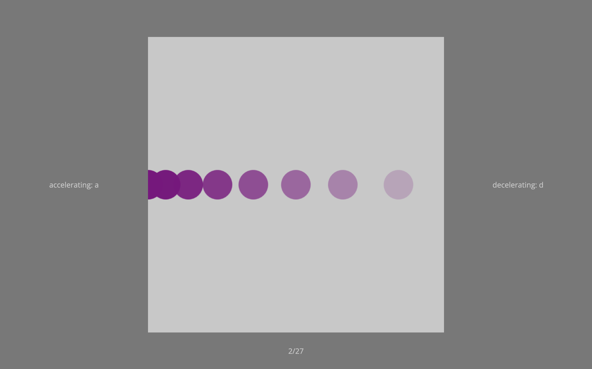

```{r setup, include = FALSE}
library('groundhog')
packages = c(
    'papaja',
    'tidyverse',
    'lsr', 
    'pwr', 
    'dplyr',
    'ggplot2',
    'ggimage',
    'lattice',
    'gridExtra',
    'quickpsy'
  )
groundhog.library(packages, "2023-10-16")
r_refs("references.bib")
knitr::opts_chunk$set(fig.pos = "!H", out.extra = "", warning = FALSE)
```

```{r analysis-preferences}
# Seed for random number generation
set.seed(42)
knitr::opts_chunk$set(cache.extra = knitr::rand_seed)
```

# Motivation

In a previous experiment, we found similar perceptual repulsion effects for lifelong and recently learned expectations about the acceleration of objects. First, acceleration perception was biased away from gravitational expectations, such that objects moving downwards were perceived as accelerating less than upwards moving objects (replicating @phan2022downwards). Critically, we also obtained a similar repulsive bias in the gravitationally neutral horizontal plane by inducing expectations to see objects accelerating more often in one direction and decelerating more often in the other. This bias was driven by expectations learned in a 20-minute online study, rather than by lifelong expectations of gravitational forces. In the current study, we aim to replicate this horizontal bias in the absence of strong contextual cues, with circles moving on a neutral, gray background.


# Methods

We report below how we determined our sample size, all exclusion criteria, all manipulations, and all measures in the study.

## Participants

The research complies with all relevant ethical regulations, and was approved by the Research Ethics Committee of Birkbeck, University of London (study ID number 1812000). Participants will be recruited via Prolific, and will give informed consent prior to their participation. To be eligible to take part in this study, their Prolific approval rate will need to be 95% or higher, their reported first language English, their age between 18 and 60, and they cannot have taken part in experiment 1. We will collect data until we reach 46 included participants (after applying our pre-registered exclusion criteria). The entire experiment will take 10 minutes to complete. Participants will be paid around £1.34 for their participation, equivalent to an hourly wage of £8.

## Study Design

Participants will see a light grey square displayed over 80% of the screen height with a virtual height and width of 4 m (Fig. \@ref(fig:design1)). On each trial, a circle, with virtual diameter of 40cm (10% of the square height) travels either left or right across the entire width of the grey square. It can be accelerating, decelerating, or travelling at a constant velocity. Participants are asked to press the 'A' key if they think the circle is accelerating and the 'D' key if they think it is decelerating. They can respond as soon as the circle disappears from the square and there is no time limit for their response. Participants are given written instructions prior to the task and at all times are shown the instructions "accelerating: a", "decelerating: d", and the number of trials completed in the current block. The next trial starts 1500 ms after a response has been made.

```{r design1, echo=FALSE, fig.cap="**Layout.** A light grey square is constantly shown on the screen. On each trial, a circle travels across the square, shown here going from right to left (opacity of the circle illustrates time). Participants must decide if the circle is accelerating or decelerating (here decelerating) and can respond once it has left the square.", out.width = '100%'}

```

To avoid participants using the amount of time the circle is on the screen as an indication of acceleration or deceleration, the circle remains on the screen for one of two screen durations, 1000 or 1500 ms. For each of the two screen durations, 11 equally spaced acceleration values are chosen from the range of ± $\frac{2 \cdot square \: length}{screen \: duration ^ 2}$. A positive skew is given to one horizontal direction (Fig. \@ref(fig:design2), bottom row, hereafter accelerating direction) and a negative skew to the other one (Fig. \@ref(fig:design2), top row, hereafter decelerating direction), randomly assigned per participant. The skewed distributions have a mean acceleration of ± 1.74 m/s^2^ and also include three extreme trials with maximal acceleration/deceleration. These extreme values are presented in the first block on the 1st, 3rd, and 5th trial of the respective direction to induce a strong expectation early in the experiment. 

```{r design2, echo=FALSE, fig.cap="**Acceleration distributions.** The distribution of acceleration and deceleration values presented for leftwards motion and rightwards motion are skewed in order to induce an expectation of acceleration in one direction (bottom panel) and of deceleration in the other (top panel). These skewed distributions have a mean acceleration of ± 1.74 m/s^2^. Long trials (green) remain on the screen for 1500 ms and short trials (blue) for 1000 ms. Extreme trials (red) have maximal acceleration/deceleration and are used to induce a strong expectation within the first five trials in that direction. All extreme trials have a screen duration of 1000 ms.", out.width = '110%'}

acc_values = c(-8, -6.4, -4.8, -3.54, -3.2, -2.8, -2.1, -1.6, -1.4, -1.1, -0.7, 0, 0, 0.7, 1.1, 1.4, 1.6, 2.1, 2.8, 3.2, 3.54, 4.8, 6.4, 8);
acc_types = c("Extreme","Short","Short","Long","Short","Long","Long","Short","Long", "Short", "Long", "Short", "Long", "Long", "Short", "Long","Short","Long","Long","Short","Long","Short","Short","Extreme");

pos = data.frame(
  acc = c(-3.54, -3.2, -2.8, -2.1, -1.6, -1.4, -1.1, -1.1, -0.7, -0.7, -0.7, 0, 0, 0, 0, 0.7, 0.7, 0.7, 0.7, 1.1, 1.1, 1.4, 1.4, 1.4, 1.6, 1.6, 1.6, 1.6, 2.1, 2.1, 2.1, 2.1, 2.1, 2.8, 2.8, 2.8, 2.8, 2.8, 2.8, 3.2, 3.2, 3.2, 3.2, 3.2, 3.2, 3.54, 3.54, 3.54, 4.8, 4.8, 6.4, 8, 8, 8)
)

neg = data.frame(
  acc = c(3.54, 3.2, 2.8, 2.1, 1.6, 1.4, 1.1, 1.1, 0.7, 0.7, 0.7, 0, 0, 0, 0, -0.7, -0.7, -0.7, -0.7, -1.1, -1.1, -1.4, -1.4, -1.4, -1.6, -1.6, -1.6, -1.6, -2.1, -2.1, -2.1, -2.1, -2.1, -2.8, -2.8, -2.8, -2.8, -2.8, -2.8, -3.2, -3.2, -3.2, -3.2, -3.2, -3.2, -3.54, -3.54, -3.54, -4.8, -4.8, -6.4, -8, -8, -8)
)

color_table <- tibble(
  Trial = c("Extreme", "Long", "Short"),
  Color = c("red", "darkgreen", "blue4")
)

mneg <- ggplot(neg, aes(x=acc)) + geom_density(aes(y = after_stat(density)*(30))) + xlim(-8, 8)
mpos <- ggplot(pos, aes(x=acc)) + geom_density(aes(y = after_stat(density)*(30))) + xlim(-8, 8)
pneg <- ggplot_build(mneg)
ppos <- ggplot_build(mpos)
denseneg = 0;
densepos = 0;
for(value in acc_values){
  denseneg = c(denseneg, pneg$data[[1]]$y[which.min(abs(pneg$data[[1]]$x - value))]);
  densepos = c(densepos, ppos$data[[1]]$y[which.min(abs(ppos$data[[1]]$x - value))]);
}

df <- data.frame(
  plot = c(rep("Negative Skew",24), rep("Positive Skew",24)),
  Acceleration = rep(acc_values, 2),
  Trial = rep(acc_types, 2),
  Frequency = c(3,1,2,3,6,6,5,4,3,2,4,2,2,3,2,1,1,1,1,1,1,0,0,0,0,0,0,1,1,1,1,1,1,2,3,2,2,4,2,3,4,5,6,6,3,2,1,3),
  Density = c(denseneg[-1], densepos[-1])
)

a <- ggplot(df, aes(x = Acceleration, y = Frequency)) +
  geom_bar(stat="identity", aes(fill = Trial)) +
  geom_line(aes(y = Density)) +
  geom_area(aes(y = Density), alpha = 0.2, fill = "#56B4E9") +
  scale_fill_manual(values = color_table$Color) +
  theme(plot.title = element_text(hjust = 0.5)) +
  theme(axis.text.x=element_text(size=4, angle=90),
        axis.text.y=element_text(size=5),
        axis.title=element_text(size=10),
        plot.title=element_text(size=10),
        legend.title=element_text(size=6),
        legend.text=element_text(size=6),
        strip.text.y = element_text(size = 10),
        legend.key.size = unit(0.2, 'cm')) + 
  scale_x_continuous(breaks = acc_values) +
  facet_grid(rows = vars(plot)) 
a
```

The experiment starts with eight practice trials - one accelerating and one decelerating trial for each of the two screen durations and two motion directions. For the accelerating direction, values of -1.6, -1.4, 3.6, and 8 m/s^2^ are presented and for the decelerating direction, -8, -3.6, 1.4, and 1.6 m/s^2^ are presented. Participants only receive feedback on their performance during practice. Afterwards, they complete 4 blocks of 27 trials with the acceleration values shown in Fig. \@ref(fig:design2) and between each block they can take a short break. The motion direction, acceleration value, and screen duration for each trial are pseudo-randomised.

### Randomization

The accelerating and decelerating directions for each participant, the motion direction, the acceleration value, and screen duration for each trial will be determined pseudo-randomly by the Mersenne Twister pseudorandom number generator, initialized in a way that ensures registration time-locking [@mazor2019novel].


## Data analysis

### Rejection criteria

Participants will be excluded if their overall accuracy falls below 75% for all trials, including practice and extreme trials.

### Hypotheses and analysis plan

This study is designed to replicate the repulsive bias for acceleration perception in the horizontal plane when the background does not provide any directional cues. The data will be analysed in the same way as for the previous experiment (pre-registration: "Transient and stable predictions affect motion perception, Exp. 1").

*Hypothesis 1 (ACCELERATION PERCEPTION FOR ACCELERATING VS. DECELERATING DIRECTIONS)*: We will test the null hypothesis that horizontal acceleration perception is similar for accelerating and decelerating directions. For each participant, the proportion of 'accelerating' responses will be calculated for each acceleration/deceleration value within the range ± 3.6 m/s^2^ and then averaged, separately for the accelerating and decelerating direction. A paired-samples t-test will be performed comparing the proportion of 'accelerating' responses for accelerating vs. decelerating directions.

*Hypothesis 2 (PSCV FOR ACCELERATING VS. DECELERATING)*: We will test the null hypothesis that the point of subjective constant velocity (PSCV) is similar for accelerating and decelerating directions. The PSCV will be estimated using the quickpsy function of the quickpsy R package with acceleration/deceleration values in the range ± 3.6 m/s^2^ as the explanatory variable, and participant, screen duration and motion direction as grouping factors [@R-quickpsy]. Psychometric curves with a PSCV outside of the tested range (± 8 m/s^2^) will be excluded from analysis. A single PSCV will be calculated for each motion direction by taking the mean of the PSCVs for each screen duration. A paired-samples t-test  will be performed comparing the PSCV for the accelerating and decelerating directions.

Exploratory analyses will compare slope and accuracy measures for accelerating vs. decelerating motion.

## Sample size justification

```{r calculate_sample_size}
# Load in experiment one results and filter out the people who's accuracy is <0.75
# Then adjust data frame for fitting of psychometric curves
data_frame <- read.csv("../Results/expOneResults.txt");
df = data_frame %>% 
  filter(trial_type == "moving-image") %>%
  mutate(acceleration = as.numeric(acceleration)) %>%
  mutate(numerical_correct = if_else(correct=='true', 1, if_else(acceleration == 0, NaN, 0))) %>%
  mutate(recodeKey = if_else(key_response == 'a', 1, if_else(key_response == 'd', 0, NaN))) %>%
  mutate(recodeDir = if_else((direction == 'RIGHT' & right_bias == 'Positive') | (direction == 'LEFT' & left_bias == 'Positive'), 'ACCELERATING', if_else((direction == 'RIGHT' | direction == 'LEFT'), 'DECELERATING', direction))) %>%
  group_by(subject_id) %>%
  mutate(average_accuracy = mean(numerical_correct, na.rm = TRUE)) %>%
  ungroup() %>%
  filter(average_accuracy >= 0.75) %>%
  filter(practice == "false") %>%
  filter(abs(as.numeric(acceleration))<=3.6)

fullFit <- quickpsy(d = df, x=acceleration, k=recodeKey, grouping = .(subject_id, recodeDir,screen_duration), bootstrap = "none");
#plotcurves(fullFit) + xlim(-4,4) + theme(legend.position="none")

# fullFit$thresholds is the pscv for each participant, each direction, and each screen duration
# We want to ignore vertical directions then mean the pscv for screen duration, then paired samples t-test between accelerating and decelerating
# We also remove pcsv's that are outside our range of presented values
pscvs = fullFit$thresholds %>%
  filter(recodeDir == 'ACCELERATING' | recodeDir == 'DECELERATING') %>%
  pivot_wider(names_from = screen_duration, values_from = thre, names_prefix = "sd_") %>%
  mutate(mean_pscv = mean(c(sd_1000, sd_1500))) %>%
  select(subject_id, recodeDir, mean_pscv) %>%
  pivot_wider(names_from = recodeDir, values_from = mean_pscv) %>%
  filter(abs(ACCELERATING)<=8 & abs(DECELERATING)<=8)
   
# Use cohensD to calculate the effect size and then sample size
effect_size = cohensD(pscvs$ACCELERATING, pscvs$DECELERATING, method = "paired")
sample_size_needed = ceiling(pwr.t.test(n=NULL, d=effect_size, sig.level=0.05, power=0.95, type='paired', alternative='two.sided')$n)


# Other analysis technique is: for each participant, the proportion of 'accelerating' responses will be calculated for each acceleration value within the range ± 3.6 m/s^2^ and then averaged, separately for acc and dec motion. A paired-samples t-test will be performed comparing the proportion of 'accelerating' responses for acc vs. dec motion.

bias = df %>% 
  group_by(subject_id, recodeDir, acceleration, screen_duration) %>% 
  summarise(prop_acc=mean(recodeKey)) %>%
  group_by(subject_id, recodeDir, screen_duration) %>% 
  summarise(screen_bias=mean(prop_acc)) %>% 
  group_by(subject_id, recodeDir) %>% 
  summarise(bias=mean(screen_bias)) %>% 
  spread(recodeDir, bias)

bias_effect_size = cohensD(bias$ACCELERATING, bias$DECELERATING, method = "paired")
bias_sample_size_needed = ceiling(pwr.t.test(n=NULL, d=bias_effect_size, sig.level=0.05, power=0.95, type='paired', alternative='two.sided')$n)

```
Using the horizontal effect size from the psychometric curve fitting analysis in the previous preregistered experiment (pre-registration: "Transient and stable predictions affect motion perception, Exp. 1"), a sample size of `r sample_size_needed` is necessary for a power of 0.95. Using the effect size from the bias analysis in the previous preregistered experiment (pre-registration: "Transient and stable predictions affect motion perception, Exp. 1"), a sample size of `r bias_sample_size_needed` is necessary for a power of 0.95. As the effect sizes are similar for both analyses and the psychometric curve analysis has stricter exclusion criteria, we base the power analysis on the bias analysis. Therefore, collecting a sample of `r bias_sample_size_needed` participants should provide sufficient power to observe the effect of interest.

# References

```{=tex}
\begingroup
\setlength{\parindent}{-0.5in}
\setlength{\leftskip}{0.5in}
```
::: {#refs custom-style="Bibliography"}
:::

```{=tex}
\endgroup
```
