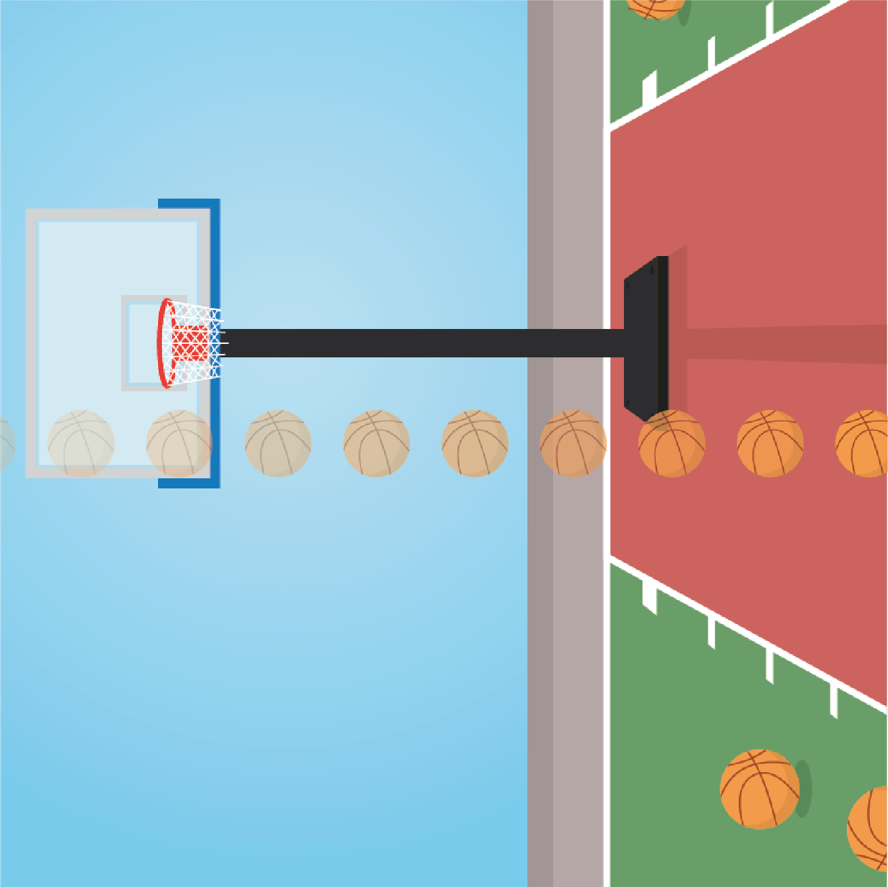

```{r setup, include = FALSE}
library("papaja")
library('pwr')
r_refs("references.bib")
knitr::opts_chunk$set(fig.pos = "!H", out.extra = "", warning = FALSE)
```

```{r analysis-preferences}
# Seed for random number generation
set.seed(42)
knitr::opts_chunk$set(cache.extra = knitr::rand_seed)
```

# Motivation
@phan2022downwards have shown that objects travelling downwards are perceived as less accelerating than objects travelling upwards. They conclude that participants are biased away from their expectation that gravity causes objects to accelerate downwards. This repulsive expectation effect could be driven by two distinct mechanisms; a low level effect governed by the expectation that objects travelling from the top to the bottom of the retina should accelerate, and/or a high level contextual effect that objects travelling downwards in their environment should accelerate. In the current study, we rotate the background of the experiment (a scene with an obvious sky and groun) to 90 and 270 degrees in order to determine whether the downward repulsion effect is determined by retinal motion direction or direction with respect to the context.

# Methods

We report how we determined our sample size, all data exclusions (if any), all manipulations, and all measures in the study.

## Participants

The research complies with all relevant ethical regulations, and was approved by the Research Ethics Committee of Birkbeck, University of London (study ID number 1812000). Participants will be recruited via Prolific, and will give informed consent prior to their participation. To be eligible to take part in this study, their Prolific approval rate will need to be 95% or higher, their reported first language English, and their age between 18 and 60. We will collect data until a Bayesian t-test offers sufficient evidence for (BF>3), or against (BF<1/3), the two null hypotheses described below, or until we reach a pre-specified maximum number of 250 included participants. The entire experiment will take 15 minutes to complete. Participants will be paid approximately £2 for their participation, equivalent to an hourly wage of £8.

## Study Design

Participants will see a rotated basketball court displayed over 80% of the screen height with a virtual height and width of 4 m (Fig. \@ref(fig:design1)). On each trial, a basketball appears on the court and either travels up, down, left, or right. The ball can be accelerating, decelerating, or travelling at a constant velocity and participants have to press the 'A' key if they think the ball is accelerating and the 'D' key if they think it is decelerating. They can respond as soon as the ball has disappeared from the court and there is no time limit for their response. Participants are given written instructions prior to the task and at all times are shown the instructions "accelerating: a", "decelerating: d", and the number of trials completed in the current block. The next trial starts 1500 ms after a response has been made.

```{r design1, echo=FALSE, fig.cap="**Layout.** A basketball court is constantly shown on the screen and a basketball travels across the court in the horizontal or vertical directions, shown here going right (opacity of the ball illustrates time). Participants decide if the ball is accelerating or decelerating and can respond once the ball has left the court.", out.width = '50%'}

```

To avoid participants using the amount of time the ball is on the screen as an indication of acceleration or deceleration, the ball remains on the screen for one of two screen durations, 1000 or 1500 ms. For each of the two screen durations, 11 equally spaced acceleration values are chosen from the range of ± $\frac{2 \cdot court \: size}{screen \: duration ^ 2}$. An approximately Gaussian distribution of values is chosen with a mean of 0 m/s^2^ (Fig. \@ref(fig:design2)). This same distribution of acceleration values is presented for leftward, rightward, upward, and downward moving balls giving a total of 224 trials.

```{r design2, echo=FALSE, fig.cap="**Acceleration distributions.** An approximately Gaussian distribution (bottom) of acceleration values centred around a mean of 0 m/s^2^ (constant velocity). Long trials (green) remain on the screen for 1500 ms and short trials (blue) for 1000 ms.", out.width = '110%'}

library(ggplot2)
library(ggimage)
library(lattice)
library(gridExtra)
library(dplyr)
library(BayesFactor)

#acc_values = c(-6.4, -4.8, -3.54, -3.2, -2.8, -2.1, -1.6, -1.4, -1.1, -0.7, 0, 0.7, 1.1, 1.4, 1.6, 2.1, 2.8, 3.2, 3.54, 4.8, 6.4);
acc_values = c(-4.8, -3.54, -3.2, -2.1, -1.6, -1.4, -1.1, -0.7, 0, 0.7, 1.1, 1.4, 1.6, 2.1, 3.2, 3.54, 4.8);
acc_types = c("Short","Long","Short","Long","Short","Long", "Short", "Long","Short","Long", "Short", "Long","Short","Long","Short","Long","Short");
vert = data.frame(
  #acc = c(-6.4, -4.8, -3.54, -3.54, -3.2, -2.8, -2.1, -2.1, -2.1, -1.6, -1.6, -1.6, -1.4, -1.4, -1.4, -1.4, -1.1,-1.1, -0.7, -0.7, -0.7, -0.7, -0.7, 0, 0, 0, 0, 0, 0, 0, 0, 0.7, 0.7, 0.7, 0.7, 0.7, 1.1, 1.1, 1.4, 1.4, 1.4, 1.4, 1.6, 1.6, 1.6, 2.1, 2.1, 2.1, 2.8, 3.2, 3.54, 3.54, 4.8, 6.4)
  acc = c(-4.8, -4.8, -3.54, -3.54, -3.2, -3.2, -2.1, -2.1, -1.6, -1.6, -1.6, -1.6, -1.4, -1.4, -1.4, -1.4, -1.1,-1.1, -0.7, -0.7, -0.7, -0.7, -0.7, -0.7, 0, 0, 0, 0, 0, 0, 0, 0, 0.7, 0.7, 0.7, 0.7, 0.7, 0.7, 1.1, 1.1, 1.4, 1.4, 1.4, 1.4, 1.6, 1.6, 1.6, 1.6, 2.1, 2.1, 3.2, 3.2, 3.54, 3.54, 4.8, 4.8)
)
color_table <- tibble(
  Trial = c("Long", "Short"),
  Color = c("darkgreen", "blue4")
)

mvert <- ggplot(vert, aes(x=acc)) + geom_density(aes(y =after_stat(density)*(30))) + xlim(-8, 8)
pvert <- ggplot_build(mvert)
densevert = 0;
for(value in acc_values){
  densevert = c(densevert, pvert$data[[1]]$y[which.min(abs(pvert$data[[1]]$x - value))]);
}

df <- data.frame(
  plot = c(rep("Vertical",17)),
  Acceleration = rep(acc_values, 1),
  Trial = rep(acc_types, 1),
  #Frequency = c(1,1,2,1,1,3,3,4,2,5,8,5,2,4,3,3,1,1,2,1,1),
  Frequency = c(2,2,2,2,4,4,2,6,8,6,2,4,4,2,2,2,2),
  Density = c(densevert[-1])
)

a <- ggplot(df, aes(x = Acceleration, y = Frequency)) +
  geom_bar(stat="identity", aes(fill = Trial)) +
  geom_line(aes(y = Density)) +
  geom_area(aes(y = Density), alpha = 0.2, fill = "#56B4E9") +
  scale_fill_manual(values = color_table$Color) +
  ggtitle("Acceleration Distributions") +
  theme(plot.title = element_text(hjust = 0.5)) +
  theme(axis.text.x=element_text(size=4, angle=90),
        axis.text.y=element_text(size=5),
        axis.title=element_text(size=10),
        plot.title=element_text(size=10),
        legend.title=element_text(size=6),
        legend.text=element_text(size=6),
        strip.text.y = element_text(size = 10),
        legend.key.size = unit(0.2, 'cm')) + 
  scale_x_continuous(breaks = acc_values) +
  facet_grid(rows = vars(plot)) 
a
```

The experiment starts with 16 practice trials - one accelerating and one decelerating trial for each of the two screen durations and four motion directions. Acceleration values of -3.2, -2.1, 2.1, and 3.2 m/s^2^ are presented for each motion direction. Participants only receive feedback on their performance during practice and the background is not rotated. Afterwards, they are reminded of the instructions and told that the background will occasionally change direction. They then complete eight blocks of 28 trials with the acceleration values shown in Fig. \@ref(fig:design2). They can take a short break after each block. The motion direction, acceleration value and screen duration are pseudo-randomised. Additionally, the orientation of the background is switched between 90 and 270 degrees every block. The trials within each oriented background are counterbalanced such that the trials in each objective motion direction are equal.

### Randomization

The motion direction within the plane, the acceleration value and screen duration for each trial will be determined pseudo-randomly by the Mersenne Twister pseudorandom number generator, initialized in a way that ensures registration time-locking [@mazor2019novel].


## Data analysis

### Rejection criteria

Participants will be excluded if their overall accuracy falls below 75%.

### Hypotheses and analysis plan

This study is designed to test the perception of acceleration comparing motion directions associated with acceleration to ones associated with deceleration, either using retinal direction expectations (up/down) or contextual expectations (left/right).

*Hypothesis 1 (ACCELERATION PERCEPTION FOR UPWARD VS. DOWNWARD MOTION)*: We will test the null hypothesis that vertical acceleration perception is similar for upward and downward motion. For each participant, the proportion of 'accelerating' responses will be calculated for each acceleration value and then averaged, separately for the screen durations and motion direction. The bias for each screen duration will be averaged to give a single value for each direction and each participant. A Bayesian paired-samples t-test will be performed comparing the proportion of 'accelerating' responses for upward vs. downward motion.

*Hypothesis 2 (ACCELERATION PERCEPTION FOR PSEUDO-UPWARD VS. PSEUDO-DOWNWARD DIRECTIONS)*: We will test the null hypothesis that horizontal acceleration perception is similar for leftward and rightward motion when context indicates one to be upward and the other to be downward. For each participant, the proportion of 'accelerating' responses will be calculated for each acceleration value and then averaged, separately for the screen durations and motion direction relative to the background. The bias for each screen duration will be averaged to give a single value for each direction and each participant. A Bayesian paired-samples t-test will be performed comparing the proportion of 'accelerating' responses for pseudo-upward vs. pseudo-downward motion.

*Hypothesis 3 (PSCV FOR UPWARD VS. DOWNWARD)*: We will test the null hypothesis that the point of subjective constant velocity (PSCV) is similar for upward and downward motion. The PSCV will be estimated using the quickpsy function of the quickpsy R package with acceleration/deceleration values as the explanatory variable, and participant, screen duration, and motion direction as grouping factors [@R-quickpsy]. Psychometric curves with a PSCV outside of the tested range (± 4.8 m/s^2^) will be excluded from analysis. A single PSCV will be calculated for each motion direction by taking the mean of the PSCVs for each screen duration and background orientation. A Bayesian paired-samples t-test will be performed comparing the PSCV for upward and downward motion.
 
*Hypothesis 4 (PSCV FOR PSEUDO-UPWARD VS. PSEUDO-DOWNWARD)*: We will test the null hypothesis that the point of subjective constant velocity (PSCV) is similar for leftward and rightward motion when context indicates one to be upward and the other to be downward. The PSCV will be estimated using the quickpsy function of the quickpsy R package with acceleration/deceleration values as the explanatory variable, and participant, screen duration, and motion direction relative to the background as grouping factors [@R-quickpsy]. Psychometric curves with a PSCV outside of the tested range (± 4.8 m/s^2^) will be excluded from analysis. A single PSCV will be calculated for each motion direction by taking the mean of the PSCVs for each screen duration and background orientation. A Bayesian paired-samples t-test will be performed comparing the PSCV for pseudo-upward and pseudo-downward motion.

Exploratory analyses will compare slope and accuracy measures for upward vs. downward motion and acc vs. dec motion.

## Sample size justification

This study will use a Bayesian stopping rule based on hypotheses 3 and 4. We will collect participants until a Bayesian t-test gives a Bayes factor of more than 3 or less than 1/3, for both hypotheses. The Bayesian t-test will be run with a scale factor of 0.37 (half the effect size of the vertical repulsion effect found in a previous study https://osf.io/xjh9n) using the ttestBF function of the r package BayesFactor [@R-BayesFactor]. We will initially collect 50 participants and perform the Bayesian t-test on the data for hypotheses 3 and 4. Then, if the Bayes factor is not above 3 or below 1/3 for one or more of the hypotheses, we will collect an additional 25 participants and re-test the Bayes factor. We will continue this process until enough evidence for or against both null hypotheses is collected, or until the participant cap of 250 included participants is reached.

# References

```{=tex}
\begingroup
\setlength{\parindent}{-0.5in}
\setlength{\leftskip}{0.5in}
```
::: {#refs custom-style="Bibliography"}
:::

```{=tex}
\endgroup
```
