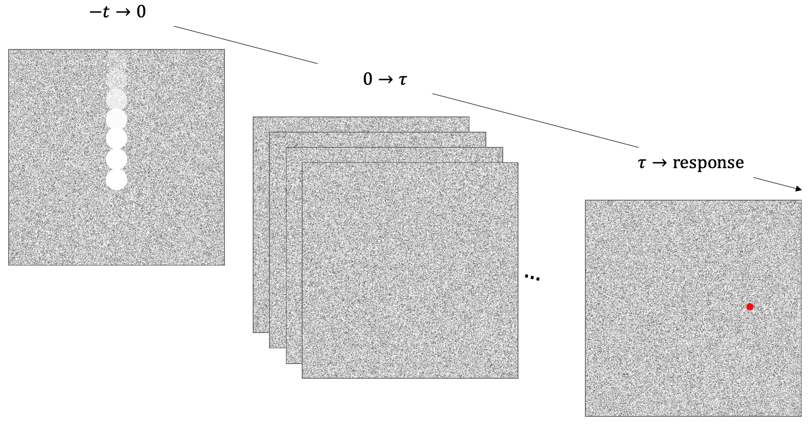

```{r setup, include = FALSE}
library("papaja")
library('pwr')
r_refs("references.bib")
knitr::opts_chunk$set(fig.pos = "!H", out.extra = "", warning = FALSE)
```

```{r analysis-preferences}
# Seed for random number generation
set.seed(42)
knitr::opts_chunk$set(cache.extra = knitr::rand_seed)
```

# Motivation

Previous studies have found three cases of expectation affecting the perception of acceleration in online studies. First, downward moving objects are perceived as less accelerating than upward moving objects due to the expectation that gravity causes objects to accelerate downwards. Second, when objects travelling in one horizontal direction more often accelerate and objects travelling in the other direction more often decelerate, the objects travelling in the direction associated with acceleration are perceived as less accelerating. Finally, when horizontally moving objects can be one of two colours, and one colour more often accelerates and the other more often decelerates, objects of the colour associated with acceleration are perceived as more accelerating than objects of the colour associated with deceleration. These three effects constitute two repulsions from expectation and one attraction to expectation. In order to understand whether these effects are decisional or perceptual, we can use the twinkle-goes illusion created by @NakayamaTwinkleGoes. As this illusion requires reporting the location of the ball at the time of disappearance, there is little benefit from adding a decisional bias, meaning that any difference in illusion strength for the conditions described above would be more likely a perceptual effect than a decisional one (see @FRITSCHE2019107). This particular study focuses on the vertical repulsion effect.

# Methods

We report how we determined our sample size, all data exclusions (if any), all manipulations, and all measures in the study.

## Participants
**CHECK**
The research complies with all relevant ethical regulations, and was approved by the Research Ethics Committee of Birkbeck, University of London (study ID number 1812000). Participants will be recruited via Prolific, and will give informed consent prior to their participation. To be eligible to take part in this study, their Prolific approval rate will need to be 95% or higher, their reported first language English, and their age between 18 and 60. We will collect data until we reach 100 included participants (after applying our pre-registered exclusion criteria). The entire experiment will take 15 minutes to complete. Participants will be paid £2 for their participation, equivalent to an hourly wage of £8.

## Study Design

Participants will see static white noise displayed over 80% of the screen height with a virtual height and width of 4 m (Fig. \@ref(fig:design1)). On each trial, a white ball appears on the court and travels at a constant velocity either up or down. During motion on the screen, the ball will disappear and dynamic noise will be shown on the screen for **X ms**. The participants are then asked to click on the location where they last saw the centre of the ball. They can respond as soon as the dynamic noise ends and there is no time limit for their response. Participants are given written instructions prior to the task and at all times are shown the number of trials completed in the current block. The next trial starts **1500** ms after a response has been made.

```{r design1, echo=FALSE, fig.cap="**Paradigm.** Static white noise is shown over 80% of the participants' screen. A white ball travels at a constant velocity through the static noise for a time t, where t is randomly selected such that some trials show the ball for longer than other trials. After t seconds, the ball disappears and the white noise becomes static for  $\\tau$ seconds. After  $\\tau$ seconds, the background becomes static again and the participant is able to move a red cursor with their mouse and click to select the location at which they last saw the ball.", out.width = '100%'}

```

To avoid participants adjusting to the illusion strength, **two** different velocities are presented in equal proportions. The balls can disappear in steps of 10% from 20% to 80% of the white noise size. Each trial type is repeated four times, thus, for the two directions, **two** velocities, and seven disappearance points, there are a total of 112 trials. Additionally, one trial of each type will be presented with no dynamic noise to test whether the illusory effect is working. All trials are ordered randomly with breaks every 28 trials to allow participants time to rest. The experiment starts with 8 practice trials - 2 for each velocity for each direction with randomised disappearance points. No feedback is given during practice or testing in order to reduce the possibility of effecting the illusion. **To ensure people are doing it correctly do we want to add practice with no twinkle and give feedback?**


### Randomization

The order of trials will be determined pseudo-randomly by the Mersenne Twister pseudorandom number generator, initialized in a way that ensures registration time-locking [@mazor2019novel].


## Data analysis

### Rejection criteria

<!-- any RT exclusions? -->
Participants will be excluded **How can we tell if people are doing it properly? Add in catch trials as well as no twinkle?**

### Hypotheses and analysis plan

This study is designed to test the influence of a gravitational expectation on the size of the twinkle-goes illusory effect. We will test the null hypothesis that the twinkle-goes illusory effect size is similar for upward and downward motion. The practice, **catch**, and non-twinkle trials will be removed from the analysis. For each participant, and separately for the two directions, the average vertical difference between participant reports and true ball disappearance will be calculated. Then a paired samples t-test will be calculated to compare the illusory effect size for upward motion vs downward motion. All statistical tests will be two-tailed and the significance level set to 0.05.

Exploratory analyses will further decompose the trial types into disappearance position.

## Sample size justification

**Discuss**

# References

```{=tex}
\begingroup
\setlength{\parindent}{-0.5in}
\setlength{\leftskip}{0.5in}
```
::: {#refs custom-style="Bibliography"}
:::

```{=tex}
\endgroup
```
